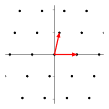
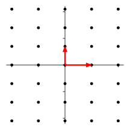
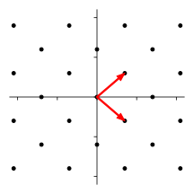
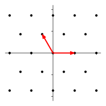
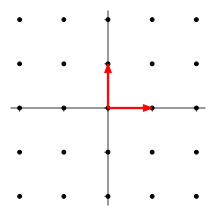

# Lattice Types in 2D

For 2D lattices, the finiteness of the point group $P \le \O(2)$ and the crystallographic restriction imply that $P$ can only be one of the following 10 groups:

$$
C_n, D_n \quad n = 1,2,3,4,6
$$

*Remark*: Although $C_2, D_1$ are isomorphic, they will be distinguished by the action on the lattice vectors in $T$. 

 

These point groups leads to 5 **types** of 2D lattices. In the following classification, 

- The basis vector $t_1$ is always chosen as $(1,0)$ under the standard basis. 
- All representation matrices are under the lattice basis $\{t_1,t_2\}$.

To obtain the other lattice basis $t_2$, we can simply use the rotation operation:

*Theorem*: If $P$ contains a rotation $c_n$ by angle $2\pi/n$ ($n \ge 3$), we can choose the lattice basis vectors as $\{t_1, c_n t_1\}$.

 

## $C_1, C_2$: Oblique Lattice

This lattice type is the most general one, possessing least symmetry, corresponding to $C_1$ (translation only) and $C_2$ (with rotation by $\pi$). In generator notation:

$$
C_1 = \{1\}, \quad
C_2 = \expect{c_2}
$$

Under the lattice basis, the rotation $c_2$ by $\pi$ is represented by

$$
c_2 = \begin{pmatrix}
    -1 & 0 \\ 0 & -1
\end{pmatrix}
$$

## $D_1, D_2$: Rectangular or Rhombic Lattice

## $C_3, D_3, C_6, D_6$: Hexagonal Lattice

The second basis vector for both $n = 3, 6$ can be chosen as

$$
t_2 = c_3 t_1 = \bigg(
    -\frac{1}{2}, \frac{\sqrt{3}}{2}
\bigg)^\mathsf{T}
$$

Then the representation matrices for the rotations are

$$
c_6 = \begin{pmatrix}
    1 & -1 \\ 1 & 0
\end{pmatrix}, \quad 
c_3 = c_6^2 = \begin{pmatrix}
    0 & -1 \\ 1 & -1
\end{pmatrix}
$$

It remains to determine the matrix $f$ for reflection.

## $C_4, D_4$: Square Lattice

The second basis vector can be chosen as

$$
t_2 = c_4 t_1 = (0,1)^\mathsf{T}
$$

Under this basis, the rotation $c_4$ is represented by

$$
c_4 = \begin{pmatrix}
    0 & -1 \\ 1 & 0
\end{pmatrix}
$$
