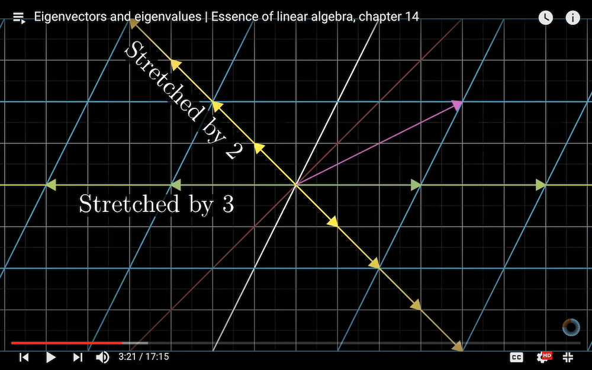

# Eigenvalues and Eigenvectors

## Invitation: A Collision Problem

This problem is borrowed from the Grant Sanderson's video [*The most unexpected answer to a counting puzzle*](https://youtu.be/HEfHFsfGXjs). He posted a [more geometrical solution](https://youtu.be/jsYwFizhncE) to this problem, which I strongly suggest you to watch. But nevertheless, I will make use a more algebraic approach to lead to the same geometrical picture. Some manipulation of complex numbers is involved. 

Let us call the big block 1, and the small block 2, and take right as the positive direction of velocity. Let $v_1^{(n)}, v_2^{(n)}$ be the velocities of 1,2 after the $n$th collision. The initial state is

$$
v_1^{(0)} = -v_0 < 0, \quad
v_2^{(0)} = 0
$$

i.e. the big block 1 moves towards the small block 2. There will be series of collisions (all of which are assumed to be perfectly elastic) following:

$$
\begin{align*}
    &\text{1 and 2 $\to$ 2 and Wall $\to$ 1 and 2 $\to \cdots$}
    \\
    &\cdots \to
    \begin{cases}
        \text{2 and Wall (end)} \\
        \text{2 and Wall $\to$ 1 and 2 (end)}
    \end{cases}
\end{align*}
$$

We see that there are two possible endings. People discover that when $m_1 / m_2 = 10^{2d}$, the number of collisions is the *first $\mathcal{D} + 1$ digits of $\pi$*! Now we shall prove why this is true. 

|        $m_1 / m_2$ | Number of Collisions |
| -----------------: | :------------------- |
|       $10^2 = 100$ | 31                   |
|    $10^4 = 10,000$ | 314                  |
| $10^6 = 1,000,000$ | 31415                |

When the collision ends, we must have

$$
0 \le v_2^{(n)} \le v_1^{(n)}
$$

Now let us find the relation between $v_{1,2}^{(n)}$ and $v_{1,2}^{(n+1)}$. 

- When $n = 0,2,4,...$ (even), the next collision happens between 1 and 2. Using conservation of linear momentum and energy, we obtain
    
    $$
    \begin{align*}
        m_1 v_1^{(n)} + m_2 v_2^{(n)}
        &= m_1 v_1^{(n+1)} + m_2 v_2^{(n+1)}
        \\
        \frac{1}{2} m_1 v_1^{(n)2}
        + \frac{1}{2} m_2 v_2^{(n)2}
        &= \frac{1}{2} m_1 v_1^{(n+1)2}
        + \frac{1}{2} m_2 v_2^{(n+1)2}
    \end{align*}
    $$

    Solving this set of equations, we obtain the familiar result ($a \equiv m_1 / m_2$)

    $$
    \begin{align*}
        v_1^{(n+1)} &= \frac{a-1}{a+1} v_1^{(n)}
        + \frac{2}{a+1} v_2^{(n)}
        \\
        v_2^{(n+1)} &= \frac{2a}{a+1} v_1^{(n)}
        + \frac{-a+1}{a+1} v_2^{(n)}
    \end{align*}
    $$

    This set of linear equations can be written as matrix-vector product: define

    $$
    v^{(n)} \equiv \begin{bmatrix}
        v_2^{(n)} \\ v_1^{(n)}
    \end{bmatrix}, \quad
    P = \frac{1}{a+1} \begin{bmatrix}
        a-1 & 2 \\
        2a & -a+1
    \end{bmatrix}
    $$

    Then we can elegantly write

    $$
    v^{(n+1)} = P v^{(n)} \qquad n = 0,2,4,...
    $$

- When $n = 1,3,5,...$ (odd), the next collision happens between 2 and the wall. Things are easy in this case:
    
    $$
    v_1^{(n+1)} = v_1^{(n)}
    \qquad
    v_2^{(n+1)} = - v_2^{(n)}
    $$

    Defining the matrix 

    $$
    Q = \begin{bmatrix}
        1 & 0 \\
        0 & -1
    \end{bmatrix}
    $$

    We obtain

    $$
    v^{(n+1)} = Q v^{(n)} \qquad n = 1,3,5,...
    $$

Now we can use the $P,Q$ matrices to calculate the velocities after $n$ collisions:

$$
v^{(n)} = \underbrace{\cdots Q P Q P}_{n \text{ matrices}} 
\, v^{(0)}
$$

First, consider the simpler case when there will be $n = 2k \, (k = 0,1,2,...)$ collisions. Then we combine $QP = S$, and

$$
v^{(2k)} = \underbrace{S \cdots S}_{k \text{ matrices}} v^{(0)} = S^k v^{(0)}
$$

The matrix elements of $S$ are

$$
S = \frac{1}{a+1}
\begin{bmatrix}
    a-1 & 2 \\
    -2a & a-1
\end{bmatrix}
$$

How can we calculate $S^k$? Although you may be tempted to directly calculate by hand, things will be quite a mess if $k$ is a very large number. Here we introduce one method to overcome this difficulty: the **eigen-decomposition** (a.k.a. **spectral decomposition**).

## Eigenvalues and Eigenvectors

First let us go through some formal math. Let $V$ be a vector space. Given a linear map $A: V \to V$, a (nonzero) vector $v \in V$ is called an **eigenvector** of $A$ with **eigenvalue** $\lambda$ if

$$
A v = \lambda v
$$

i.e. the action of $A$ on $v$ is simply *scale* it by a factor of $\lambda$. This definition can be easily generalized to the representation matrix of $A$. 

Obviously, for any *(complex) number* $a$

$$
A (av) = \lambda (av)
$$

i.e. the length of the eigenvector is arbitrarily. Conventionally, we shall take $|v| = 1$ (normalized).

An obvious but important theorem on the eigenvectors is

**Eigenvectors associated with different eigenvalues  are linearly independent**.

The proof is simple; you can try to figure it out by yourself. 

### Finding Eigenvalues and Eigenvectors

Now we describe how to find the eigenvalues and eigenvectors for a 2D transformation matrix. We rewrite the definition as

$$
Av = \lambda 1 v \Rightarrow (A - \lambda 1) v = 0
$$

where 1 is the identity matrix. 

Now consider $A - \lambda 1$ as a new transformation. We know that *any invertible linear map cannot send a nonzero vector to zero* (prove it by yourself!). Therefore, if the equation $(A - \lambda 1) v = 0$ have nonzero solutions of $v$, $A - \lambda 1$ cannot be invertible, which is equivalent to saying that its determinant vanishes. Thus, a *sufficient* condition for $\lambda$ to be an eigenvalue of $A$ is

$$
\det (A-\lambda 1) = 0
$$

It turns out that this is also a *necessary* condition. Thus, the equation above gives all the eigenvalues of $A$. 

Finally, we return to the equation $(A - \lambda 1) v = 0$ to determine the eigenvectors. 

### The Characteristic Polynomial

The expression $\det (A - \lambda 1)$ is called the **characteristic polynomial** of the linear map (matrix) $A$, because it is indeed a polynomial of the eigenvalue $\lambda$, and is of degree $n = \dim{V}$. 

Some consequences immediately follow:

- A linear map in $n$-dimensions (an $n \times n$ matrix) will have $n$ eigenvalues (in the *complex plane*), which are the roots of the characteristic polynomial (due to the [**fundamental theorem of algebra**](https://en.wikipedia.org/wiki/Fundamental_theorem_of_algebra)).

    - Even if the matrix of $A$ is real, *its eigenvalues can still be complex*. 

- Some eigenvalues may *repeat* in the roots of the characteristic polynomial. The number of times $k_i$ that one eigenvalue $\lambda_i$ repeats is called **algebraic multiplicity** of $\lambda_i$.

### Examples in Two Dimensions

- **An Ordinary Transformation Without Name**
    
    $$
    A = \begin{bmatrix}
        3 & 1 \\
        0 & 2
    \end{bmatrix}
    $$

    

       
    *Eigenvalues and eigenvectors of the transformation (matrix) $A$*

    

    Let us solve

    $$
    \begin{align*}
        \det (A - \lambda 1)
        &= \det \begin{bmatrix}
            3 - \lambda & 1 \\
            0 & 2 - \lambda
        \end{bmatrix}
        \\
        &= (3-\lambda)(2-\lambda) = 0
    \end{align*}
    $$

    The results are

    $$
    \lambda_1 = 3,
    \quad
    \lambda_2 = 2
    $$

    Finally, let us find the eigenvectors (up to a scaling factor):

    $$
    \begin{align*}
        (R - \lambda_1 1) v_1
        &= \begin{bmatrix}
            0 & 1 \\
            0 & -1
        \end{bmatrix} v_1
        = \begin{bmatrix}
            0 \\ 0
        \end{bmatrix}
        &\, \Rightarrow \, &
        v_1 = \begin{bmatrix}
            1 \\ 0
        \end{bmatrix}
        \\ \\
        (R - \lambda_2 1) v_2
        &= \begin{bmatrix}
            1 & 1 \\
            0 & 0
        \end{bmatrix} v_2
        = \begin{bmatrix}
            0 \\ 0
        \end{bmatrix}
        &\, \Rightarrow \, &
        v_2 = \begin{bmatrix}
            -1 \\ 1
        \end{bmatrix}
    \end{align*}
    $$

- **Isotropic Scaling**
    
    $$
    S = \begin{bmatrix}
        2 & 0 \\
        0 & 2
    \end{bmatrix}
    $$

    The eigenvalues are

    $$
    \lambda_1 = \lambda_2 = 2
    $$

    You can verify that *all* vectors in the 2D vector space are eigenvectors of $S$. Usually we shall only write down the two orthonormal ones to represent all of them:

    $$
    v_1 = \begin{bmatrix}
        1 \\ 0
    \end{bmatrix}, \quad
    v_2 = \begin{bmatrix}
        0 \\ 1
    \end{bmatrix}
    $$

- **Shear**
    
    $$
    S = \begin{bmatrix}
        1 & 1 \\
        0 & 1
    \end{bmatrix}
    $$

    This shear transformation moves the end of $e_2$ by length 1 along $e_1$. Solving $\det S - \lambda 1 = 0$, we find the eigenvalues are

    $$
    \lambda_1 = \lambda_2 = 1
    $$

    To find eigenvectors, we write

    $$
    (S - \lambda 1)v
    = \begin{bmatrix}
        0 & 1 \\
        0 & 0 
    \end{bmatrix} \begin{bmatrix}
        v_x \\ v_y
    \end{bmatrix} = \begin{bmatrix}
        0 \\ 0
    \end{bmatrix}
    $$

    The only nonzero solutions are scalar multiple of

    $$
    v = \begin{bmatrix}
        1 \\ 0
    \end{bmatrix}
    $$

    Thus we see that although the eigenvalue 1 repeats twice, it only have one linearly-independent eigenvector. 

- **Rotation**

    $$
    R(\theta) = \begin{bmatrix}
        \cos \theta & -\sin \theta\\
        \sin \theta & \cos \theta
    \end{bmatrix}
    $$

    Let us solve

    $$
    \begin{align*}
        \det (R - \lambda 1)
        &= \det \begin{bmatrix}
            \cos \theta - \lambda & -\sin \theta\\
            \sin \theta & \cos \theta - \lambda
        \end{bmatrix}
        \\
        &= \lambda^2 - 2\lambda \cos \theta + 1 = 0
    \end{align*}
    $$

    The results are *just amazing*:

    $$
    \begin{align*}
        \lambda_1 &= e^{-i\theta} = \cos \theta - i \sin \theta
        \\
        \lambda_2 &= e^{+i\theta} = \cos \theta + i \sin \theta
    \end{align*}
    $$

    Now you have seen an example where the matrix is real, but the eigenvalues are complex. Is it obvious to you that 2D rotation matrix cannot have real eigenvalues?

    Next, let us find the eigenvectors of $\lambda_1$:

    $$
    \begin{align*}
        (R - \lambda_1 1) v
        &= \begin{bmatrix}
            i \sin \theta & -\sin \theta \\
            \sin \theta & i \sin \theta
        \end{bmatrix} v
        \\
        &= \sin \theta \begin{bmatrix}
            i & -1 \\
            1 & i
        \end{bmatrix} \begin{bmatrix}
            v_x \\ v_y
        \end{bmatrix} = \begin{bmatrix}
            0 \\ 0
        \end{bmatrix}
    \end{align*}
    $$

    Then, the eigenvectors of $R(\theta)$ are

    $$
    \begin{align*}
        v_1 &= \begin{bmatrix}
            1 \\ i
        \end{bmatrix} 
        &\quad 
        &\text{(corresponding to $\lambda_1 = e^{-i\theta}$)}
        \\
        v_2 &= \begin{bmatrix}
            1 \\ -i
        \end{bmatrix} 
        &\quad 
        &\text{(corresponding to $\lambda_2 = e^{+i\theta}$)}
    \end{align*}
    $$

## Eigen-Decomposition

### Eigenspace

For a linear map (matrix) $A$, the vector space formed by the linear combination of all eigenvectors (called the **span** of these vectors) corresponding to the eigenvalue $\lambda$ is called the **eigenspace** of $A$ associated with $\lambda$. 

The dimension of the eigenspace $m_i$ is called the **geometric multiplicity** of the eigenvalue $\lambda_i$. Equivalently, $m_i$ is the number of *linearly-independent* eigenvectors associated with $\lambda_i$.

We state without proof that

$$
1 \le m_i \le k_i
$$

For example, if $\lambda$ occurs *only once* ($k = 1$) in the list of eigenvalues, and have one eigenvector $v$, then all possible eigenvectors associated with $\lambda$ can only be $c \lambda \, (c \in \mathbb{C})$. Thus the eigenspace is one-dimensional ($m = 1$).

Besides, as we have seen in the example of shear matrix, the eigenvalue $\lambda = 1$ has algebraic multiplicity $k = 2$, but its eigenspace is only one-dimensional ($m = 1 < 2$). 

### Diagonalization of Matrix

When the algebraic multiplicity and geometric multiplicity are equal for all eigenvalues of a matrix $A$, we can directly use the eigenvectors as a set of basis vectors of the vector space $V$. 

Since the action of a linear map $A$ on its eigenvectors is simply scaling, the representation matrix (denoted by $\Lambda$) is very simple: it is just a diagonal matrix, whose diagonal elements are just its eigenvalues:

$$
\Lambda = \text{diag } (\lambda_1, ..., \lambda_n)
= \mathcal{D}^{-1} A \mathcal{D}
$$

where $\mathcal{D}$ is the change-of-basis matrix, whose columns are eigenvectors of $A$: 

$$
\mathcal{D} = (v_1, v_2, ..., v_n)
$$

Such a process is called **diagonalization**, and $A$ is said to be **diagonalizable**. We may also write

$$
A = \mathcal{D} \Lambda \mathcal{D}^{-1}
$$

This is called the **eigen-decomposition** of $A$. This is especially useful when we want to calculate the matrix power $AA \cdots A$, as can be seen in the following interesting example. 

*Remark*: 

If the geometric multiplicity of some eigenvalue is smaller than its algebraic multiplicity, the span of its eigenvectors have a smaller dimension than $V$, and hence cannot serve as a set of basis vectors. Such matrices (e.g. the 2D shear matrix) are said to be **not diagonalizable**. 

### Return to the Collision Problem

Let the eigen-decomposition of the matrix $S = QP$ be 

$$
S =
\frac{1}{a+1}
\begin{bmatrix}
    a-1 & 2 \\
    -2a & a-1
\end{bmatrix}
= \mathcal{D} \Lambda \mathcal{D}^{-1}
$$

The eigenvalues (diagonal elements of $\Lambda$) are

$$
\lambda_1 = \lambda \equiv \frac{\sqrt{a}-i}{\sqrt{a}+i} , 
\qquad
\lambda_2 = \bar{\lambda} \equiv \frac{\sqrt{a}+i}{\sqrt{a}-i}
$$

We notice that $\lambda_2$ is the *complex conjugate* of $\lambda_1$. The eigenvectors (columns of the $\mathcal{D}$ matrix) are 

$$
\begin{align*}
    \mathcal{D} = \begin{bmatrix}
        i/\sqrt{a} & -i/\sqrt{a} \\
        1 & 1
    \end{bmatrix} 
    \, \Rightarrow \,
    \mathcal{D}^{-1} = \frac{1}{2} \begin{bmatrix}
        -i\sqrt{a} & 1 \\
        i\sqrt{a} & 1
    \end{bmatrix}
\end{align*}
$$

Then 

$$
\begin{align*}
    S^k &= (\mathcal{D} \Lambda \mathcal{D}^{-1})^k
    \\
    &= \mathcal{D} \Lambda \mathcal{D}^{-1} \mathcal{D} \Lambda \mathcal{D}^{-1} \cdots \mathcal{D} \Lambda \mathcal{D}^{-1}
    \\
    &= \mathcal{D} \Lambda^k \mathcal{D}^{-1}
\end{align*}
$$

But since $\Lambda$ is diagonal, finding its power is easy:

$$
\Lambda^k = \begin{bmatrix}
    \lambda^k & 0 \\
    0 & \bar{\lambda}^{k}
\end{bmatrix}
$$

Thus (we omit some details of the calculation here and just give the result)

$$
v^{(2k)} = S^k v^{(0)} 
= \frac{v_0}{2}
\begin{bmatrix}
- (\lambda^k + \bar{\lambda}^k)
\\
i \sqrt{a} (\lambda^k - \bar{\lambda}^k)
\end{bmatrix}
$$

To further simplify the expression, we make use of the exponential notation of complex numbers: let

$$
\lambda = r e^{-i \theta} = r (\cos \theta - i \sin \theta)
$$

We add a minus sign before $\theta$ for convenience later. Obviously $r = |\lambda| = 1$; to determine $\theta$, we rewrite $\lambda$ as

$$
\begin{align*}
    \lambda &\equiv \frac{\sqrt{a}-i}{\sqrt{a}+i}
    = \frac{(\sqrt{a}-i)^2}{(\sqrt{a}+i)(\sqrt{a}-i)}
    \\
    &= \frac{(a - 1) - 2 \sqrt{a} i}{a + 1}
\end{align*}
$$

Thus

$$
\tan \theta 
= \frac{2 \sqrt{a}}{a - 1}
$$

i.e. $\theta$ is an angle between $0$ and $\pi/2$. Then

$$
\begin{align*}
    v^{(2k)} &= \frac{v_0}{2}
    \begin{bmatrix}
        - (e^{-ik\theta} + e^{ik\theta}) \\
        i \sqrt{a} (e^{-ik\theta} - e^{ik\theta})
    \end{bmatrix}
    \\
    &= v_0 \begin{bmatrix}
        - \cos k\theta \\
        \sqrt{a} \sin k\theta
    \end{bmatrix}
\end{align*}
$$

For the odd collisions $n = 2k-1 \, (k = 1,2,...)$, we simply reverse the direction of $v_2$ to obtain

$$
v^{(2k-1)} = P^{-1} v^{(2k)}
= v_0 \begin{bmatrix}
    -\cos k \theta \\
    - \sqrt{a} \sin k \theta
\end{bmatrix}
$$

The $\sqrt{a}$ factor in the second slot of the column vector $v_2$ is especially annoying; let us get rid of it by defining an new column vector

$$
V^{(n)} \equiv \frac{1}{v_0} 
\begin{bmatrix}
    v_1^{(n)} \\ v_2^{(n)} / \sqrt{a}
\end{bmatrix}
$$

Then we make $V^{(n)}$ always *on the unit circle*:

$$
\begin{align*}
    V^{(2k)} &= \begin{bmatrix}
        -\cos k\theta \\ \sin k\theta
    \end{bmatrix} &\quad &k = 0,1,2,...
    \\
    V^{(2k-1)} &= \begin{bmatrix}
        -\cos k\theta \\ -\sin k\theta
    \end{bmatrix} &\quad &k = 1,2,3...
\end{align*} 
$$

The collision stops at $0 \le v_2 \le v_1$. In terms of the components of $V^{(n)}$, this condition reads

$$
0 \le V_2 \le \frac{V_1}{\sqrt{a}}
$$

Here comes Grant Sanderson's geometric picture. Let us draw the column vectors $V^{(n)}$ after each collision on the unit circle. The result is shown below: when $V^{(n)}$ falls in the green-shaded region labelled "end zone", the collision stops. 

When a collision happens, we shall add a disk sector with angle $\theta$. For example, when $a = 16$, we read from the figure that there can be 12 collisions. 

   
*Visualization of $V^{(n)}$ after each collision when $a = 16$*

Now we set $a = 10^{2d}$ and see what will happen. Such an $a$ is large enough so that we can approximately treat (recall that $\arctan x \approx x$ when $x$ is small enough)

$$
\theta = \arctan \frac{2 \sqrt{a}}{a - 1}
\approx \frac{2 \sqrt{a}}{a - 1}
\approx \frac{2}{\sqrt{a}} = 2 \times 10^{-\mathcal{D}}
$$

And the angle in the "end zone" is approximately $\theta / 2$:

$$
\arctan \frac{1}{\sqrt{a}} 
\approx \frac{1}{\alpha} = 1 \times 10^{-\mathcal{D}}
$$

For comparison, we give the numerical values of $\theta$ up to 10 digits:

|  $\mathcal{D}$  |   $\theta$   |
| :---: | :----------: |
|   1   | 0.1993373050 |
|   2   | 0.0199993334 |
|   3   | 0.0019999993 |
|   4   | 0.0002000000 |
|   5   | 0.0000200000 |

