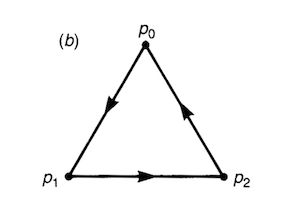

# Examples of Homology Groups

### Some Useful Theorems (Repeated from Part 1)

----

*Theorem 1*: (**0th Homology group of connected simplicial complex**)

Let $K$ be a *connected* simplicial complex. Then

$$
H_0(K) \cong \mathbb{Z}
$$

----

*Theorem 2*: (**Fundamental theorem of homomorphism**)

Let $f: G_1 \to G_2$ be a group homomorphism. Then

$$G_1 / \ker{f} \cong \text{im }f$$

----

## Example 1

   
*The simplicial complex in Example 1*

$$
K = \{p_0, p_1, p_2, (p_0 p_1), (p_1 p_2), (p_2 p_0)\}
$$

This simplicial complex is *connected*, and contains 0- and 1-simplexes only. Thus we only need to find $H_0(K)$ and $H_1(K)$.

### The Chain Groups

$$
\begin{align*}
    C_0(K) &= \{z_0 = i p_0 + j p_1 + k p_2 
    \mid i,j,k \in \mathbb{Z}\}
    \\
    C_1(K) &= \{z_1 = i (p_0 p_1) + j (p_1 p_2) + k (p_2 p_0)\mid i,j,k \in \mathbb{Z}\}\}
\end{align*}
$$

### Homology Group $H_0(K)$

Since $K$ is connected, by [Theorem 1](#theorem-1-0th-homology-group-of-connected-simplicial-complex), we must have

$$H_0(K) \cong \mathbb{Z}$$

Nevertheless, we verify this result by direct calculation. 

- **Cycle Group $Z_0(K)$**

    This is the same as $C_0(K)$

    $$
    Z_0(K) = \{z_0 = i p_0 + j p_1 + k p_2 
    \mid i,j,k \in \mathbb{Z}\} \cong \mathbb{Z^3}
    $$

- **Boundary Group $B_0(K)$**

    The 0-boundaries, which are boundaries of 1-chains, are

    $$
    \begin{align*}
        \partial z_1 &= i (p_0 - p_1) + j (p_1 - p_2) + k (p_2 - p_0) 
        \\
        &= (i-k)p_0 + (-i+j)p_1 + (-j+k)p_2
        \\
        & = i' p_0 + j' p_1 + k' p_2
    \end{align*}
    $$

    However, the three integers $i', j', k'$ are not independent:

    $$
    i' + j' + k' = (i-k) + (-i+j) + (-j+k) = 0
    $$

    Thus

    $$
    B_0(K) = \{i' p_0 + j' p_1 - (i' + j')p_2
    \mid i', j' \in \mathbb{Z}\} \cong \mathbb{Z}^2
    $$

Finally

$$
H_1(K) \equiv Z_1(K) / B_1(K) \cong 
\mathbb{Z}^3 / \mathbb{Z}^2 = \mathbb{Z}
$$

### Homology Group $H_1(K)$

- **Cycle Group $Z_1(K)$**

    $$
    \begin{align*}
        \partial z_1 &= (i-k)p_0 + (-i+j)p_1 + (-j+k)p_2 \overset{!}{=} 0
        \\
        &\Rightarrow i = j = k 
        \\
        &\Rightarrow Z_1(K) \cong \mathbb{Z}
    \end{align*}
    $$

    This result is intuitive: the cycle without boundary

    $$
    i \, ((p_0 p_1) + (p_1 p_2) + (p_2 p_0))
    $$

    is just the original triangular path scaled by a factor of $i$. 

- **Boundary Group $B_1(K)$**

    Since there is no 2-simplexes in $K$, we have

    $$
    B_1(K) = \{0\} \quad \text{(The trivial group)}
    $$

Finally

$$
H_1(K) \equiv Z_1(K) / B_1(K) \cong 
\mathbb{Z}/\{0\} = \mathbb{Z}
$$

## Example 2

   
*The simplicial complex in Example 2*

$$
K = \{p_0, p_1\}
$$

This is a *disconnected* simplicial complex (so that Theorem 1 is not applicable) containing 0-simplexes only. Thus we only calculate $H_0$.

The 0-chain group (which is also the 0-cycle group)  is

$$
C_0(K) = Z_0(K) = \{z_0 = i p_0 + j p_1 
\mid i,j \in \mathbb{Z}\} \cong \mathbb{Z}^2
$$

There is no 1-simplexes in $K$, thus

$$
B_0(K) = \{0\}
$$

Finally

$$
H_0(K) \equiv Z_0(K) / B_0(K) \cong 
\mathbb{Z}^2/\{0\} = \mathbb{Z}^2
$$
