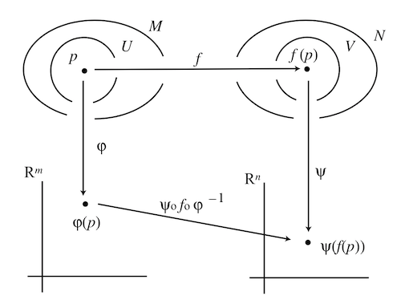
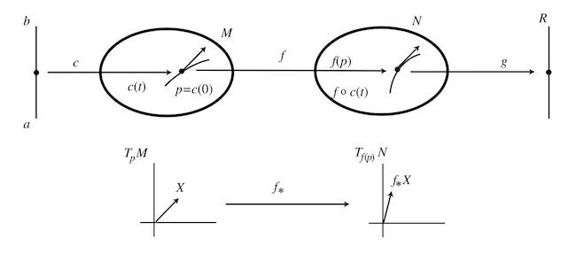

# The Calculus on Manifolds

## Differentiable Maps

   
*Coordinate representation of map between two manifolds*

*Definition*:

Let $f$ be a map from an $m$-dimensional manifold $M$ to an $n$-dimensional manifold $N$.   
Let $p$ be a point in $M$, which is mapped to $f(p) \in N$.

- **Coordinate representation of $f$ at $p$**: the map from the *coordinate* of $p$ to the *coordinate* of $f(p)$. 

    Mathematically, let $(U,\varphi)$ be a chart containing $p$, and $(V, \psi)$ be a chart containing $f(p)$. The coordinate representation of $f$ is (read from right to left)

    $$ \psi \circ f \circ \varphi^{-1}: \mathbb{R}^m \to \mathbb{R}^n $$

    *Special cases*: 

    - **Curve $c$**: from real line interval $M \subset \mathbb{R}$ to manifold   
        Coordinate representation: $\psi \circ c$   
        The set of *smooth* functions on $M$: $\mathcal{F}(M)$
    
    - **(Real-valued) Function $f$**: from manifold to real line $N \subset \mathbb{R}$   
        Coordinate representation: $f \circ \varphi^{-1}$

- **Differentiability (smoothness) of $f$ at $p$**: if the coordinate representation of $f$ is differentiable (in the usual sense) at the coordinate $\varphi(p)$, we say $f$ is **differentiable at $p$**.

- **Diffeomorphism**: if the coordinate representation of $f$ has a *smooth* inverse, then $f$ is called a **diffeomorphism** between $M$ and $N$.
    
    - **Diffeomorphic manifolds**: if we can find a diffeomorphism between two manifolds, then they are **diffeomorphic** to each other. 
    
    - **Diffeomorphism group $\text{Diff}(M)$**: the group containing all diffeomorphism $f: M \to M$.

    *Remark*:
    
    - The dimension of two diffeomorphic manifolds must be the same;
    - The diffeomorphic relation is an *equivalence relation*.

## Tangent Vectors and Tangent Space

### In Euclidean Space

Let $p$ be a point in an $m$-dimensional manifold $M$. We assign a chart $(U, \varphi)$ near $p$. A curve $c: (a,b) \subset \mathbb{R} \to M \, (a < 0 < b)$ goes across the point $p = c(0)$. 

In order to use our previous geometrical intuition to find the tangent vectors to $M$, we *embed* $M$ into an $n$-dimensional $(n \ge m)$ Euclidean space $\mathbb{R}^n$. (The operation of embedding will be described [later](#sub-manifolds).) Suppose the chart $(U, \varphi)$ is embedded by the equations

$$
X^\mu = X^\mu(x^1, ..., x^m) \qquad
\mu = 1,2,...,n
$$

where $x = \varphi(q)$ are coordinates of any point $q \in M$. 

*Example*: a 2-sphere $S^2$ is embedded in the Euclidean space $\mathbb{R}^3$ by 

$$
\left\{
\begin{align*}
    X^1 &= \sin{x^1} \cos{x^2} \\
    X^2 &= \sin{x^1} \sin{x^2} \\ 
    X^3 &= \cos{x^1}
\end{align*}
\right. , \qquad
\begin{align*}
    &0 \le x^1 \le \pi \\
    &0 \le x^2 < 2 \pi
\end{align*}
$$

- **Tangent vector**

    Let us find the tangent vector at $p$, whose coordinates are $\varphi(p) = (x^1_0, ..., x^m_0)$, along some general curve $c: (a,b) \to M$. The coordinate representation is

    $$
    \varphi \circ c(t) \equiv (x^1(t), ..., x^m(t))
    $$

    The curve is then embedded in $\mathbb{R}^n$ by

    $$
    X^\mu = X^\mu(x^1(t), ..., x^m(t)) \qquad
    i = 1,2,...,n
    $$

    The $i$th component of the **tangent vector** at $p$ along $c$ (expressed in $\mathbb{R}^n$) is then easily found to be

    $$
    v^\mu = \frac{d X^\mu}{dt}(0)
    =
    \frac{\partial X^\mu}{\partial x^\nu}(x_0)
    \frac{d x^\nu}{dt}(0)
    $$

- **Tangent space and its basis vectors**

    There are $m$ special curves passing the point $p$:

    $$
    \varphi \circ c_i(t) = (x^1_0, ..., \underbrace{t}_{i\text{th slot}}, ..., x^m_0), 
    \quad i = 1,2,...,m
    $$

    i.e. except the $i$th coordinate (set to $t$), the others are all fixed. Then the tangent vector along $c_\mu$ is

    $$
    e_\mu = (0, ..., 0, \underbrace{\frac{\partial X^\mu}{\partial x^\mu}(x_0)}_{\mu \text{th slot}}, 0, ..., 0)
    $$

    The $m$ vectors $\{e_1, ..., e_m\}$ form a **coordinate basis** of the **tangent space** (denoted by $T_p M$) at the point $p$. We see that $\dim{T_p M} = \dim{M}$.

### Definition without Euclidean Space

In the above analysis, we discover some differential operators independent of the embedding function $X^\mu$. They are adopted as the definitions that exist by themselves.

Again, let $p$ be a point in an $m$-dimensional manifold $M$. We assign a chart $(U, \varphi)$ near $p$; the local coordinates are labelled by $x$. A curve $c: (a,b) \subset \mathbb{R} \to M \, (a < 0 < b)$ goes across the point $p = c(0)$. 

- **Tangent vector $V$ at $p$ to $M$ along the direction of $c$**: the differential operator $V$ determined by $c(t)$ (and the coordinate variables) as

    $$
    V \equiv V^\mu \left(\frac{\partial}{\partial x^\mu}\right)
    = V^\mu e_\mu, \quad
    V^\mu = \frac{d (\varphi^\mu \circ c) (t)}{dt}
    $$

    *Remark*: 

    - The numbers $V^\mu$ are called the **components of $V$**.
    
    - The vector $V \in T_p M$ can act on a smooth function $f \in \mathcal{F(M)}: M \to \mathbb{R}$, denoted by

        $$
        V[f] = V^\mu \partial_\mu (f \circ \varphi^{-1})(x)
        $$

- **Tangent space $T_p M$**: the vector space spanned by all tangent vectors at $p$ to $M$.

    - **Coordinate basis of $T_p M$**
        
        $$
        e_\mu \equiv \frac{\partial}{\partial x^\mu}, \quad
        \mu = 1,2,...,m
        $$

### Change of Basis

Suppose we have two charts $(U_i, \varphi_i), (U_j, \varphi_j)$ that cover a common point $p \in M$. The coordinates of $p$ in the two charts are $x \equiv \varphi_i(p), y \equiv \varphi_j(p)$. The basis vectors in the two charts are 

$$
e_\mu \equiv \frac{\partial}{\partial x^\mu}, \quad
\tilde{e}_\mu \equiv \frac{\partial}{\partial y^\mu}
$$

They are related by the *Jacobian*

$$
\frac{\partial}{\partial x^\mu} =
\frac{\partial y^\nu}{\partial x^\mu}
\frac{\partial}{\partial y^\nu}
\, \Rightarrow \,
e_\mu = 
\frac{\partial y^\nu}{\partial x^\mu}
\tilde{e}_\nu
$$

For any vector $V \in T_p M$, its components under the two bases are determined by

$$
V = V^\mu e_\mu = \tilde{V}_\mu \tilde{e}_\mu
$$

Therefore (we also write down the transformation from $e_\mu$ to $\tilde{e}_\mu$)

$$
\tilde{e}_\mu = \frac{\partial x^\nu}{\partial y^\mu} e_\nu
, \quad
\tilde{V}^\mu = \frac{\partial y^\mu}{\partial x^\nu} V^\nu
$$

We notice that the transformation matrices for $V^\mu$ and $e_\mu$ are *inverse* of each other. 

## One-forms and Cotangent Space

*Definition*:

- **Cotangent space $T_p^* M$**: the *dual space* of the tangent space $T_p M$

- **Cotangent vectors (one-forms)**: elements in $T_p^* M$ (i.e. *linear* functions $\omega: T_p M \to \mathbb{R}$)

### General Form of One-forms

$$
\omega = \omega_\mu dx^\mu
$$

### Inner Product

*Definition*: 

- **Inner product**: a *bilinear function*: $\langle \, , \, \rangle: T_p^* M \times T_p M \to \mathbb{R}$ defined by

$$
\begin{align*}
    \langle \omega , V \rangle
    &= \left\langle \omega_\mu dx^\mu, V^\nu \frac{\partial}{\partial  x^\nu} \right\rangle
    \\ &\equiv 
    \omega_\mu V^\nu 
    \left\langle dx^\mu, \frac{\partial}{\partial  x^\nu} \right\rangle
    = \omega_\mu V^\mu
\end{align*}
$$

### Change of Basis

Instead of $dx^\mu$, we may change to another basis of the one-forms.

## Tensors and Tensor Fields

*Definition*:

- **Tensor of type $(r,s)$**: a *multi-linear* function 
    
    $$
    T: \bigotimes^r T_p^* M \bigotimes^s T_p M \to \mathbb{R}
    $$ 
    
    which send $r$ dual vectors and $s$ vectors to a real number. Its general local coordinate expression is

    $$
    T = T^{\mu_1 ... \mu_r}_{\nu_1 ... \nu_s}
    \partial_{\mu_1} ... \partial_{\mu_r}
    dx^{\nu_1} ... dx^{\nu_s} 
    \quad
    \left(
        \partial_\mu \equiv \frac{\partial}{\partial x^\mu}
    \right)
    $$

    Action on dual vectors and vectors:

    $$
    T(\omega_1, ..., \omega_r; V_1, ..., V_s) =
    T^{\mu_1 ... \mu_r}_{\nu_1 ... \nu_s}
    (\omega_1)_{\mu_1} ... (\omega_r)_{\mu_r}
    V_1^{\nu_1} ... V_s^{\nu_s}
    $$

    The set of all $(r,s)$-tensors at point $p \in M$ is denoted by $\mathcal{T}^r_{s,p}(M)$.
    
    *Special cases*:

    - Dual vectors (1-forms): type $(0,1)$

        $$
        \Omega^1(M) \equiv \mathcal{T}^0_1(M)
        $$
        
        *Remark*: We can now write the inner product as $\langle \omega,V \rangle = \omega(V)$.
    
    - Functions (defined as 0-forms): type $(0,0)$

        $$
        \mathcal{F}(M) \equiv
        \Omega^0(M) \equiv 
        \mathcal{T}^0_0(M)
        $$

    - [$r$-Forms](5_4-Differential_Form.md): type $(0,r)$ (but is of a *special* kind)

        $$
        \Omega^r(M) \subset \mathcal{T}^0_r(M)
        $$
    
    - Vectors: type $(1,0)$

        $$
        \mathfrak{X}(M) \equiv \mathcal{T}^1_0(M)
        $$

- **Tensor fields**: a tensor which is assigned *smoothly* to each point of the manifold $M$
    
    - **Vector fields**: a vector which is assigned *smoothly* to each point of the manifold $M$

## Induced Maps: Pushforward and Pullback

*Definition*: Let $f: M \to N$ be a smooth map. 

   
*Inducing $f_*: T_p M \to T_{f(p)} N$ from $f: M \to N$*

- **Differential map (pushforward) $f_*$**: a map from tangent vectors to $M$ to tangent vectors to $N$.

    $$
    f_*: T_p M \to T_{f(p)} N
    $$

    For any vector $V \in T_p M$ and any smooth function $g: N \to \mathbb{R}$, the differential map is *defined* to satisfy

    $$
    (f_* V)[g] \equiv V[g \circ f]
    $$
    
    *Explicit form*:

    Let $(U,\varphi), (U^\prime,\psi)$ be two charts covering $p \in M, f(p) \in N$ respectively, with the coordinates denoted by $x = \varphi(p), y = \psi(p)$. 
    
    Vectors in $T_p M, T_{f(p)} N$ have the general form

    $$
    \begin{align*}
        V &= V^\mu \frac{\partial}{\partial x^\mu} \in T_p M
        \\
        f_* V \equiv W &= W^\alpha \frac{\partial}{\partial y^\alpha} \in T_{f(p)} N
    \end{align*}
    $$

    Writing the defining property explicitly:

    $$
    \begin{align*}
        (f_* V)[g] &= W^\alpha \frac{\partial (g \circ \psi^{-1})(y)}{\partial y^\alpha}
        \\
        V[g \circ f] &= V^\mu \frac{\partial (g \circ f \circ \varphi^{-1})(x)}{\partial x^\mu}
    \end{align*}
    $$

    Now we make the special choice $g = \psi^\nu$, then

    $$
    \begin{align*}
        \psi^\nu \circ \psi^{-1}(y) = \psi^\nu (f(p)) &= y^\nu \\
        \psi^\nu \circ f \circ \varphi^{-1}(x) = \psi^\nu (f(p)) &= y^\nu
    \end{align*}
    $$

    Since $\partial y^\nu / \partial y^\alpha = \delta_\alpha^\nu$, finally we obtain

    $$
    W^\nu = (f_* V)^\nu
    = V^\mu \frac{\partial y^\nu}{\partial x^\mu}
    $$

    *Special cases*:

    - $M = \mathbb{R}$, and $N$ is 1-dimensional

        Obviously, $T_p \mathbb{R} = \mathbb{R}$. Therefore, $f$ and $f_*$ both reduce to ordinary one-variable functions. 

    *Generalization of pushforward*: 

    $$
    f_*: \mathcal{T}^r_{0,p}(M) \to \mathcal{T}^r_{0,f(p)}(N)
    $$

- **Pullback $f^*$**: a map from *cotangent* vectors to $N$ *back* to *cotangent* vectors to $M$.

    $$
    f^*: T_{f(p)}^* N \to T_p^* M
    $$

    For any $V \in T_p M, \, \omega \in T_{f(p)}^* N$, the pullback should satisfy

    $$
    \langle f^* \omega, V \rangle 
    = \langle \omega, f_* V \rangle
    $$

    or using the alternative notation

    $$
    (f^* \omega)(V) = \omega(f_* V)
    $$

    *Explicit form*:

    Let $(U,\varphi), (U^\prime,\psi)$ be two charts covering $p \in M, f(p) \in N$ respectively, with the coordinates denoted by $x = \varphi(p), y = \psi(f(p))$ respectively. 
    
    Dual vectors in $T_{f(p)}^* N, T_p^* M$ have the general form

    $$
    \begin{align*}
        \omega &= \omega_\alpha dy^\alpha \in T_{f(p)}^* N
        \\
        f^* \omega \equiv \xi &= \xi_\mu dx^\mu \in T_p^* M
    \end{align*}
    $$

    Writing the defining property explicitly:

    $$
    \begin{align*}
        \langle f^* \omega, V \rangle &= \xi_\mu V^\mu
        \\
        \langle \omega, f_* V \rangle &= 
        \omega_\nu V^\mu \frac{\partial y^\nu}{\partial x^\mu}
    \end{align*}
    $$

    Since $V^\mu$ is arbitrary, we must have

    $$
    \xi_\mu = (f^* \omega)_\mu = \omega_\nu \frac{\partial y^\nu}{\partial x^\mu}
    $$

    *Generalization to pullback of $(0,r)$-tensors*:

    $$
    f^*: \mathcal{T}^0_{r,f(p)}(N) \to \mathcal{T}^0_{r,p}(M)
    $$

    For $\omega \in \mathcal{T}^0_{r,f(p)}(N)$ and vectors $V_i \in T_p M$, we *define*

    $$
    (f^* \omega)(V_1, ..., V_r) \equiv \omega(f_* V_1, ..., f_* V_r)
    $$

    The component form is

    $$
    \begin{align*}
        &(f^* \omega)_{\mu_1 ... \mu_r} 
        V_1^{\mu_1} \cdots V_r^{\mu_r}
        = \omega_{\nu_1 ... \nu_r} 
        (f_* V_1)^{\nu_1} \cdots (f_* V_r)^{\nu_r}
        \\ &\quad
        = \omega_{\nu_1 ... \nu_r} 
        \left(
            V_1^{\mu_1} \frac{\partial y^{\nu_1}}{\partial x^{\mu_1}}
        \right) \cdots \left(
            V_r^{\mu_r} \frac{\partial y^{\nu_r}}{\partial x^{\mu_r}}
        \right)
    \end{align*}
    $$

    Therefore

    $$
    (f^* \omega)_{\mu_1 ... \mu_r} 
    = \omega_{\nu_1 ... \nu_r} 
    \frac{\partial y^{\nu_1}}{\partial x^{\mu_1}} \cdots
    \frac{\partial y^{\nu_r}}{\partial x^{\mu_r}}
    $$

    i.e. $f^* \omega$ has the local coordinate expression

    $$
    f^* \omega
    = \omega_{\nu_1 ... \nu_r} 
    \frac{\partial y^{\nu_1}}{\partial x^{\mu_1}} dx^{\mu_1}
    \cdots
    \frac{\partial y^{\nu_r}}{\partial x^{\mu_r}} dx^{\mu_r}
    $$

## Sub-manifolds

