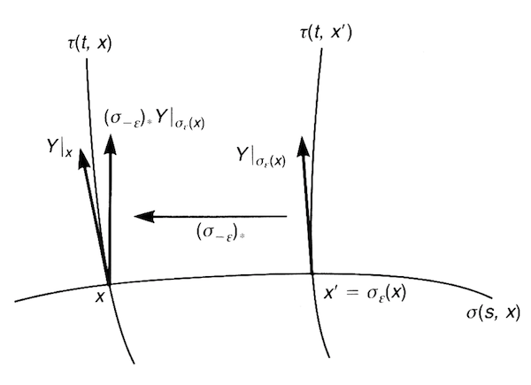
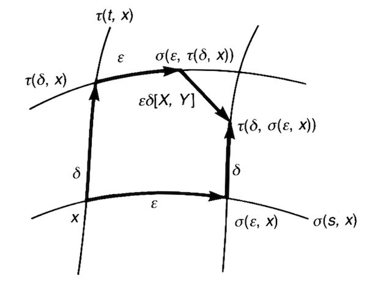

# Flows and Lie Derivative

## Flows

*Definition*: Let $V$ be a vector field defined on an manifold $M$. 

- **Integral curve of $V$**: A curve whose tangent vector at each point on it is the same as $V$ at that point.

    Mathematically, let the (coordinates of) points on the curve be $x(t)$, and the vector field be $V$. Then 

    $$
    \frac{dx^\mu(t)}{dt} = V^\mu(x(t))
    $$

    *Another notation*:

    If it is known that the curve will pass point $x_0$ at $t = 0$, we may write the points on the curve as $\sigma(t,x_0)$. The condition of the tangent vectors then becomes

    $$
    \frac{d}{dt}\sigma^\mu(t, x_0) = 
    V^\mu (\sigma(t, x_0))
    $$

    with the *initial condition* $\sigma(0, x_0) = x_0$.

- **Flow generated by $V$**: a map $\sigma: \mathbb{R} \times M \to M$ describing the "motion (flow)" of points $x \in M$; the map satisfies the following rules

    1. Initial condition

        $$
        \sigma(0, x) = x
        $$

    2. Shift of initial condition ("steady flow")

        $$
        \sigma(t, \sigma(s, x)) = \sigma(t+s, x)
        $$

    3. Tangent vectors are everywhere given by $V$

        $$
        \frac{d}{dt}\sigma^\mu(t, x) = 
        V^\mu (\sigma(t, x))
        $$

----

*Theorem*: (**Existence of Flow**)

For any point $x \in M$ and a vector field $V \in \mathfrak{X}(M)$, there exists a flow generated by $V$ passing $X$. This follows from the existence of solution of the related differential equations. 

----

*Example*: $M = \mathbb{R}^2, \, V(\mathbf{r}) = -y \partial_x + x \partial_y \quad \mathbf{r} \equiv (x,y)$

From $V(\mathbf{r})$, we read $V^1 = -y, V^2 = x$. The differential equations for the flow $\sigma$ are

$$
\frac{d}{dt} \sigma^1(t,\mathbf{r}) = -\sigma^2(t,\mathbf{r}), \quad
\frac{d}{dt} \sigma^2(t,\mathbf{r}) = \sigma^1(t,\mathbf{r})
$$

Substitute the second eq to the first one:

$$
\begin{align*}
    \frac{d^2}{dt^2} \sigma^2(t) = -\sigma^2(t)
    &\Rightarrow
    \sigma^2(t) = A \cos t + B \sin t
    \\ &\Rightarrow
    \sigma^1(t) = -A \sin t + B \cos t
\end{align*}
$$

Let the initial condition be $\sigma(0, \mathbf{r}) = \mathbf{r}$, then we can determine $A, B$:

$$
\sigma^1(0) = B = x, \quad
\sigma^2(0) = A = y
$$

Finally we obtain the flow

$$
\sigma(t, \mathbf{r}) = (x \cos t - y \sin t, \, y \cos t + x \sin t)
$$

which is a circle around the origin. 

## One-parameter Group of Transformations

*Definition*:

- **One-parameter group of transformations**: the group of flows at all *given* times.

    $$
    \sigma_t(x) \equiv \sigma(t,x): M \to M
    $$

    *Remark*: the maps $\sigma_t$ are a diffeomorphism from $M$ to itself.

    **Group structure**:

    - **Product**: 

        $$
        \sigma(t, \sigma(s, x)) = \sigma(t+s, x)
        \Rightarrow
        \sigma_t \circ \sigma_s = \sigma_{t+s}
        $$
    
    - **Identity**: $\sigma_0$
    
    - **Inverse**: $(\sigma_t)^{-1} = \sigma_{-t}$

    *Remark*: the group *locally* looks like the additive group $\mathbb{R}$ (e.g. in the chart containing point $x$). 

- **Infinitesimal generator of the transformation $\sigma_t$**: the *vector field* that generates the flow $\sigma(t,x)$.

    *Remark*: This name comes from the expansion for $\sigma_\varepsilon$ with infinitesimal $\varepsilon$

    $$
    \sigma^\mu(\varepsilon,x) = \sigma^\mu(0, x) + \varepsilon \frac{d}{dt} \sigma^\mu(0,x)
    $$

    Recall that
    
    $$
    \sigma(0, x) = x, \quad
    \frac{d}{dt}\sigma^\mu(t, x) = 
        V^\mu (\sigma(t, x))
    $$

    Thus we obtain 

    $$
    \sigma_\varepsilon^\mu(x) \equiv \sigma^\mu(\varepsilon,x) = x^\mu + \varepsilon V^\mu(x)
    $$

----

*Theorem*: (**Exponentiation of vector field**)

The flow map $\sigma(t,x)$ can be obtained from the vector field $V$ that generates it via *exponentiation*:

$$
\sigma_t^\mu(x) \equiv \sigma^\mu(t,x) = \exp(t V) x^\mu
$$

*Proof*:

Expand $\sigma(t,x)$ as a Taylor series with respect to $t$:

$$
\begin{align*}
    \sigma^\mu(t,x) &= \sigma^\mu(0, x) 
    + t \left. \frac{d}{ds} \sigma^\mu(s,x) \right|_{s=0}
    \\ &\quad 
    + \frac{t^2}{2!} \left. \frac{d^2}{ds^2} \sigma^\mu(s=0,x) \right|_{s=0}
    + \cdots
    \\
    &= \left. \left(1 + t \frac{d}{ds} + \frac{t^2}{2!} \frac{d^2}{ds^2} + \cdots \right) \sigma^\mu(s,x) \right|_{s=0}
    \\
    &= \exp \left. \left(t \frac{d}{ds} \right) \sigma^\mu(s,x) \right|_{s=0}
\end{align*}
$$

Using the fact that $V$ is the tangent vector of the flow

$$
\begin{align*}
    \frac{d}{ds}\sigma^\mu(s, x) = 
    V^\mu (\sigma(s, x))
    &\Rightarrow
    \left. \frac{d}{ds}\sigma^\mu(s, x) \right|_{s=0}
    = V^\mu (x)
\end{align*}
$$

Thus we can make the identification of operators

$$
\left. \frac{d}{ds}  \right|_{s=0} \equiv V(x)
$$

and finally obtain $\sigma^\mu(t,x) = \exp(tV) x^\mu$.

----

*Example*: $M = \mathbb{R}^2, \, V(\mathbf{r}) = -y \partial_x + x \partial_y \quad \mathbf{r} \equiv (x,y)$

From $V(\mathbf{r})$, we read $V^1 = -y, V^2 = x$. Let the initial condition be $\sigma(0, \mathbf{r}) = \mathbf{r}$.

$$
\Rightarrow
$$

Finally we obtain the flow

$$
\sigma(t, \mathbf{r}) = (x \cos t - y \sin t, \, y \cos t + x \sin t)
$$

the same as the result obtained from solving differential equations. 

## Lie Derivatives of Vectors

## Introduction

Let $X, Y$ be two vector fields, generating flows $\sigma(t,x), \tau(t,x)$ respectively:

$$
\begin{align*}
    \frac{d\sigma^\mu(s,x)}{ds} &= X^\mu(\sigma(s,x))
    \\
    \frac{d\tau^\mu(t,x)}{dt} &= Y^\mu(\tau(t,x))
\end{align*}
$$

Consider two nearby points $x$ and $x^\prime \equiv \sigma_\varepsilon(x)$ on the flow $\sigma(s,x)$. We want to compare the values of $Y$ at these two points:

$$
Y|_x \in T_x M, \quad 
Y|_{\sigma_\varepsilon(x)} \in T_{\sigma_\varepsilon(x)} M
$$

   
*Comparing tangent vectors at two points along a flow*

To do this, we shall first bring $Y|_{\sigma_\varepsilon(x)}$ to $T_x M$ by the *pushforward* of $\sigma_{-\varepsilon}$ (which maps $x^\prime$ to x)

$$
(\sigma_{-\varepsilon})_*: 
T_{\sigma_\varepsilon(x)} M \to T_x M
$$

and compare the difference

$$
(\sigma_{-\varepsilon})_* Y|_{\sigma_\varepsilon(x)}
- Y|_x
$$

*Definition*: 

- **Lie derivative of $Y$ along the flow $\sigma$ of $X$**

    We have three equivalent definitions:

    - (*Default*) Compare $Y$ at $x$ and $\sigma_{\varepsilon}(x)$, and bring $Y|_{\sigma_{\varepsilon}(x)}$ to $x$ using $(\sigma_{-\varepsilon})_*$ 

        $$
        \mathcal{L}_X Y \equiv
        \lim_{\varepsilon \to 0}
        \frac{1}{\varepsilon} [
            (\sigma_{-\varepsilon})_* Y|_{\sigma_\varepsilon(x)}
            - Y|_x
        ]
        $$

    - Compare $Y$ at $\sigma_{-\varepsilon}(x)$ and $x$, and bring $Y|_{\sigma_{-\varepsilon}(x)}$ to $x$ using $(\sigma_\varepsilon)_*$

        $$
        \mathcal{L}_X Y \equiv
        \lim_{\varepsilon \to 0}
        \frac{1}{\varepsilon} [
            Y|_x - (\sigma_\varepsilon)_* Y|_{\sigma_{-\varepsilon}(x)}
        ]
        $$
    
    - Compare $Y$ at $x$ and $\sigma_{\varepsilon}(x)$, and bring $Y|_x$ to $\sigma_\varepsilon(x)$ using $(\sigma_\varepsilon)_*$
        
        $$
        \mathcal{L}_X Y \equiv
        \lim_{\varepsilon \to 0}
        \frac{1}{\varepsilon} [
            Y|_{\sigma_\varepsilon(x)}
            - (\sigma_\varepsilon)_* Y|_x
        ]
        $$
    
## Component Form of Lie Derivative

Assign a chart $(U, \varphi)$ near $x$. Recall that for infinitesimal $\varepsilon$

$$
\sigma_\varepsilon^\mu(x) = x^\mu + \varepsilon X^\mu(x)
$$

Then we can express $Y|_{\sigma_\varepsilon(x)}$ as

$$
\begin{align*}
    Y|_{\sigma_\varepsilon(x)}
    &= Y^\mu(\sigma_\varepsilon(x)) \partial_\mu|_{\sigma_\varepsilon(x)}
    \\
    &= Y^\mu(x + \varepsilon X|_x) \partial_\mu|_{x + \varepsilon X}
    \\
    &\simeq [Y^\mu(x) + \varepsilon X^\nu(x) \partial_\nu Y^\mu(x)] \partial_\mu|_{x+\varepsilon X}
\end{align*}
$$

i.e. the components of $Y$ at $\sigma_\varepsilon(x)$ are

$$
Y^\mu(\sigma_\varepsilon(x))
= Y^\mu(x) + \varepsilon X^\nu(x) \partial_\nu Y^\mu(x)

$$

By definition of pushforward,

$$
[(\sigma_{-\varepsilon})_* Y|_{\sigma_\varepsilon(x)}]^\mu
= Y^\lambda(\sigma_\varepsilon(x)) \frac{\partial y^\mu}{\partial x^\lambda}
$$

where $y$ is the coordinate of $\sigma_{-\varepsilon}(x)$

$$
y^\mu = x^\mu - \varepsilon X^\mu(x)
$$

Then

$$
\begin{align*}
    &[(\sigma_{-\varepsilon})_* Y|_{\sigma_\varepsilon(x)}]^\mu
    \\ &= 
    [Y^\lambda(x) + \varepsilon X^\nu(x) \partial_\nu Y^\lambda(x)] \,
    \partial_\lambda[x^\mu - \varepsilon X^\mu(x)]
    \\ &=
    [Y^\lambda(x) + \varepsilon X^\nu(x) \partial_\nu Y^\lambda(x)] \,
    [\delta_\lambda^\mu - \varepsilon \partial_\lambda X^\mu(x)]
    \\ &=
    Y^\mu(x) + \varepsilon \underbrace{[
        X^\nu(x) \partial_\nu Y^\mu(x)
        - Y^\lambda(x) \partial_\lambda X^\mu(x)
    ]}_\text{Lie derivative} + O(\varepsilon^2)
\end{align*}
$$

Now we have shown that

$$
[\mathcal{L}_X Y]^\nu = 
X^\mu \partial_\mu Y^\nu
- Y^\mu \partial_\mu X^\nu
$$

## Lie Bracket

*Definition*:

- **Lie bracket $[X, Y]$**: a *vector field* whose action on functions $f \in \mathcal{F}(M)$ is given by

    $$
    [X,Y][f] = X[Y[f]] - Y[X[f]]
    $$

## Component form

By definition

$$
X[Y[f]] - Y[X[f]]
= X^\mu \partial_\mu Y^\nu \partial_\nu f
- Y^\mu \partial_\mu X^\nu \partial_\nu f
$$

from which we read the components of $[X,Y]$

$$
[X, Y]^\nu = X^\mu \partial_\mu Y^\nu 
- Y^\mu \partial_\mu X^\nu
$$

*Remark*: We have now proved that

$$
[X, Y] = \mathcal{L}_X Y
$$

## Geometric Meaning

   
*Lie bracket measures the failure of the closure of parallelograms*

Suppose we start a point $x \in M$. As before $\sigma, \tau$ are flows generated by $X, Y$ respectively. 

If we first move by "parameter distance" $\varepsilon$ along $\sigma$, then by $\delta$ along $\tau$, we will arrive at

$$
\begin{align*}
    \tau^\mu(\delta, \sigma(\varepsilon,x))
    &= \sigma^\mu(\varepsilon,x) + \delta Y^\mu(\sigma(\varepsilon,x))
    \\
    &= (x^\mu + \varepsilon X^\mu(x)) + \delta Y^\mu(x + \varepsilon X(x))
    \\
    &= x^\mu + \varepsilon X^\mu(x) + \delta Y^\mu(x) + \delta \varepsilon X^\nu(x) \partial_\nu Y^\mu(x)
\end{align*}
$$

If we *swap the two steps*, we will arrive at

$$
\begin{align*}
    \sigma^\mu(\varepsilon, \tau(\delta,x))
    &= \tau^\mu(\delta,x) + \varepsilon X^\mu(\tau(\delta,x))
    \\
    &= (x^\mu + \delta Y^\mu(x)) + \varepsilon X^\mu(x + \delta Y(x))
    \\
    &= x^\mu + \delta Y^\mu(x) + \varepsilon X^\mu(x) + \varepsilon \delta Y^\nu(x) \partial_\nu X^\mu(x)
\end{align*}
$$

We discover that

$$
\tau^\mu(\delta, \sigma(\varepsilon,x))
- \sigma^\mu(\varepsilon, \tau(\delta,x))
= \varepsilon \delta \, [X, Y]^\mu
$$

Meanwhile, we also found the condition for the Lie derivative to vanish:

$$
[X, Y] = 0 \,\Leftrightarrow\, \sigma(s,\tau(t,x)) = \tau(t,\sigma(s,x))
$$

## Properties of Lie Bracket

For vector fields $X, Y \in \mathfrak{X}(M)$:

- **Bilinearity**: for constants $c_1, c_2$
    
    $$
    \begin{align*}
        [X, c_1 Y_1 + c_2 Y_2] &= c_1 [X,Y_1] + c_2 [X,Y_2]
        \\
        [c_1 X_1 + c_2 X_2, Y] &= c_1 [X_1,Y] + c_2 [X_2,Y]
    \end{align*}
    $$

- **Anti-symmetry**: 
    
    $$ [X, Y] = - [Y, X] $$

- **Jacobi identity**:
    
    $$
    [[X,Y],Z] + [[Z,X],Y] + [[Y,Z],X] = 0
    $$

- For $f \in \mathcal{F}(M)$

    $$
    \begin{align*}
        [fX, Y] &= f[X, Y] - Y[f] X \\
        [X, fY] &= f[X, Y] + X[f] Y
    \end{align*}
    $$

- For $f: M \to N$
  
    $$
    f_* [X,Y] = [f_* X, f_* Y]
    $$

    *Proof*: Let $x,y$ be coordinates of points in $M, N$ respectively. We write down the component form of both sides $(\partial_\mu \equiv \partial/\partial x^\mu)$: 

    $$
    \begin{align*}
        (f_* [X,Y])^\mu 
        &= [X,Y]^\nu \partial_\nu y^\mu
        \\
        &= X^\lambda (\partial_\lambda Y^\nu) (\partial_\nu y^\mu)
        - Y^\lambda (\partial_\lambda X^\nu) (\partial_\nu y^\mu)
        \\
    \end{align*}
    $$

    However, for the RHS, we should be cautious that the components are in the $y$ coordinate, since $f_* X, f_* Y$ are tangent vectors to $N$ $(D_\mu \equiv \partial/\partial y^\mu)$:
    $$
    \begin{align*}
        [f_* X, f_* Y]^\mu 
        &= (f_* X)^\nu D_\nu (f_* Y)^\mu 
        - (f_* Y)^\nu D_\nu (f_* Y)^\mu
        \\
        &= (X^\lambda \partial_\lambda y^\nu) D_\nu (Y^\alpha \partial_\alpha y^\mu)
        - (Y^\lambda \partial_\lambda y^\nu) D_\nu (X^\alpha \partial_\alpha y^\mu)
        \\
        &= X^\lambda (\partial_\lambda y^\nu) (D_\nu Y^\alpha) (\partial_\alpha y^\mu)
        + X^\lambda Y^\alpha (\partial_\lambda y^\nu) (D_\nu \partial_\alpha y^\mu)
        \\
        & \quad 
        - Y^\lambda (\partial_\lambda y^\nu) (D_\nu X^\alpha) (\partial_\alpha y^\mu)
        - X^\alpha Y^\lambda (\partial_\lambda y^\nu) (D_\nu \partial_\alpha y^\mu)
    \end{align*}
    $$

    Finally, use the chain rule $\partial_\lambda y^\nu D_\nu = \partial_\lambda$ to simplify:

    $$
    \begin{align*}
        [f_* X, f_* Y]^\mu 
        &= X^\lambda (\partial_\lambda Y^\alpha) (\partial_\alpha y^\mu)
        + \cancel{X^\lambda Y^\alpha (\partial_\lambda \partial_\alpha y^\mu)}
        \\
        & \quad 
        - Y^\lambda (\partial_\lambda X^\alpha) (\partial_\alpha y^\mu)
        - \cancel{X^\alpha Y^\lambda (\partial_\lambda \partial_\alpha y^\mu)}
        \\
        &= (f_* [X,Y])^\mu \qquad \blacksquare
    \end{align*}
    $$

## Lie Derivative of General Tensors