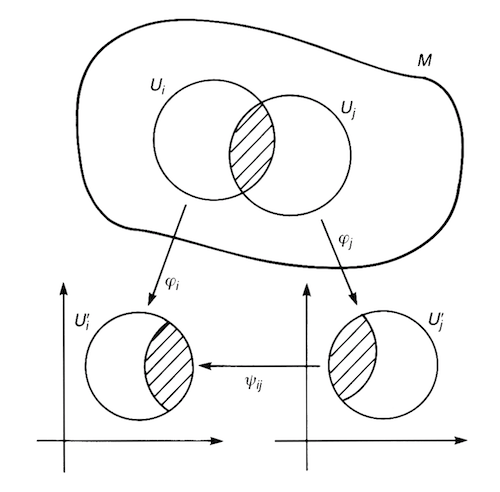
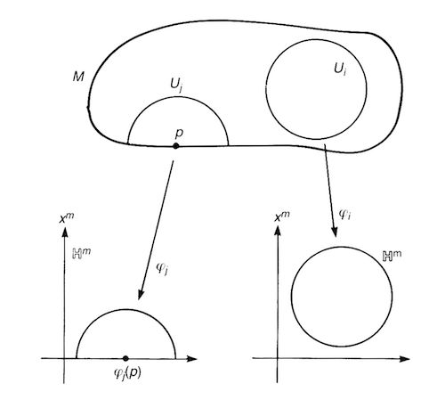

# Manifolds

*Definition*:

   
*Manifold and atlas*

- **$m$-Dimensional differentiable manifold $M$**: a topological space which is everywhere *smooth* and *locally similar* to a subset of $\mathbb{R}^m$.
    
    - **Chart**: a pair $(U_i, \varphi_i)$, in which:
        
        - **Coordinate neighborhood $U_i$**: an open subset of $M$
        
        - **Coordinate (function) $\varphi_i$**: a *homeomorphism* which maps $U_i$ to an open subset of $\mathbb{R}^m$
        
        - **Coordinate of point $p$**: the *image* of $p \in U_i$ under the map $\varphi_i$

        $$ \varphi_i: p \mapsto (\varphi_i^1(p),...,\varphi_i^m(p))$$
        
        *Remark*: it is in this sense that $U_i$ is *locally similar* to $\mathbb{R}^m$
    
    - **Atlas**: a family of charts $\{(U_i, \varphi_i)\}$, where $\bigcup_i U_i = M$ (i.e. the set $\{U_i\}$ *covers* $M$)
    
    *Remark*: The "smooth" requirement means that if two charts $(U_i, \varphi_i)$ and $(U_j, \varphi_j)$ cover a *common* part of $M$ (i.e. $U_i \cap U_j \ne \varnothing$), the *transition* from one coordinate to the other, which is implemented by (say from $\varphi_j$ to $\varphi_i$)
    
    $$
    \psi_{ij} \equiv \varphi_j^{-1} \circ \varphi_i
    $$
    
    must be *infinitely differentiable* in $U_i \cap U_j$. 

    - **Compatible atlases**
    
    - **Differentiable structure**

   
*Manifold with a boundary*

- **Manifold with a boundary**

- **Product manifold**: 