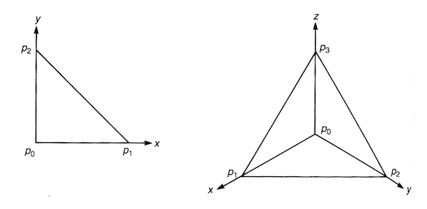

# Stokes' Theorem

## Preliminary: Integration of Differential Forms in $\mathbb{R}^m$

*Definition*:

- **Standard $r$-simplex in $\mathbb{R}^m$**: an *oriented* $r$-simplex $\bar{\sigma}_r = (p_0 p_1 ... p_r)$, which is an $r$-dimensional object in $\mathbb{R}^m \, (r \le m)$ constructed from the following $r+1$ "standard" points

    $$
    \begin{align*}
        p_0 &= (0, 0, ..., 0, 0, ..., 0) &\quad &\text{(the origin)}\\
        p_1 &= (0, 1, ..., 0, 0, ..., 0) \\
        &\vdots \\
        p_r &= (0, 0, ..., 1, 0, ..., 0)
        &\quad &\text{(unit vector of axis 1 to r)}
    \end{align*}
    $$

    By general definition of simplexes, the coordinates inside an standard $r$-simplex are

    $$
    \begin{align*}
        \bar{\sigma}_r 
        &= \left\{
            x = \sum_{\mu=0}^r x^\mu p_\mu 
            \in \mathbb{R}^m \mid 
            x_\mu \ge 0, \, \sum_{\mu=0}^r x^\mu = 1
        \right\}
        \\
        &= \left\{
            (x^1, ..., x^r, 0, ..., 0) \in \mathbb{R}^m 
            \mid
            x^\mu \ge 0, \, 
            \sum_{\mu=1}^r x^\mu \le 1
        \right\}
    \end{align*}
    $$

    *Example*: Standard 2-simplex in $\mathbb{R}^2$ and 3-simplex in $\mathbb{R}^3$ 

    

       
    *Standard 2-simplex (triangle, left) and 3-simplex (tetrahedron, right)*

    

- **Integration of $r$-form on $r$-simplex in $\mathbb{R}^r$**

    A general $r$-form (*volume element*) in $\mathbb{R}^r$ is

    $$
    \omega = a(x) \, dx^1 \wedge \cdots \wedge dx^r
    $$

    Then we *define* integration on the *standard* simplex as

    $$
    \begin{align*}
        \int_{\bar{\sigma}_r} \omega 
        &\equiv
        \int_{\bar{\sigma}_r} a(x) dx^1 \cdots dx^r
        \\
        &= \int_0^1 dx^1 \int_0^{1-x^1}dx^2 \cdots
        \int_0^{1-\sum_{\mu=1}^{r-1} x^\mu} dx^r a(x)
    \end{align*}
    $$

    For integration on *non-standard* simplexes $\sigma_r$, we can always apply an invertible transformation $y = f(x)$ such that $\bar{\sigma}_r = f (\sigma_r)$; then 

    $$
    \int_{\sigma_r} a(x) dx^1 \cdots dx^r
    = \int_{\bar{\sigma}_r} a(y) \left(
        \det \frac{\partial x}{\partial y}
    \right) dy^1 \cdots dy^r
    $$

## Chain, Cycle, Boundary on Manifolds

*Definition*: 

|Object|Symbol|
|-:|:-|
|An $r$-simplex in $\mathbb{R}^r$|$\sigma_r$|
|An $m$-dimensional manifold|$M$|

Let $f: \sigma_r \to M$ be a smooth map ($f$ needs not be invertible).

- **Singular $r$-simplex in $M$**: the image $s_r \equiv f(\sigma_r)$

    *Remark*: The name "singular" is due to:
    
    - The singular simplexes does *not* provide a *triangulation* of $M$.
    - *Geometric independence of points makes no sense* in a manifold.

- **$r$-Chain in $M$**: A *formal* linear combination of all singular $r$-simplexes in $M$

    $$
    c_r = \sum_{i} a_i s_{r,i}, \quad 
    a_i \in \mathbb{R}
    $$

    Note that we are using real-valued coefficients (instead of integers only).
    
    - **$r$-Chain group $C_r(M)$**: the group consisting of all $r$-chains on $M$

- **Boundary in $M$**: the image of the boundary of an $r$-simplex in $\mathbb{R}^r$, i.e.

    $$
    \partial s_r \equiv f(\partial \sigma_r)
    $$

    $\partial s_r$ is called an **$(r-1)$-boundary**. 

    - **Boundary map**: a linear map on chains

        $$
        \partial : C_r(M) \to C_{r-1}(M), \quad
        \partial c_r = \sum_i a_i \, \partial s_{r,i}
        $$

        *Remark*: The general result $\partial^2 = 0$ (a boundary has no boundary) still holds here.

    - **$r$-Boundary group $B_r(M)$**: the group consisting of all $r$-boundaries in $M$

- **$r$-Cycle in $M$**: an $r$-chain in $M$ that has no boundary (i.e. $\partial c_r = 0$)
    
    - **$r$-Cycle group $Z_r(M)$**: the group consisting of all $r$-cycles in $M$

- **(Singular) Homology group $H_r(M)$**:
    
    $$
    H_r(M) \equiv Z_r(M) / B_r(M)
    $$

    *Remark*: The *singular* homology group is often isomorphic to another group called the **simplicial homology group**.

## Integration on $r$-Chain

For integration of an $r$-form $\omega$ over a general $r$-chain $c = \sum_i a_i s_{r,i}$ in $M$, we define

$$
\int_c \omega \equiv \sum_i a_i \int_{s_{r,i}} \omega
$$

Now we reduced the problem to integration on a single $r$-simplex. We define

$$
\int_{s_r} \omega \equiv \int_{\sigma_r} f^* \omega
$$

where $f$ is a smooth map from a region *containing* $\sigma_r$ to $M$ (sometimes simply written as $f: \sigma_r \to M$), and $f^*$ is the corresponding pullback from $r$-forms in $M$ to $r$-forms in $\mathbb{R}^r$. 

----

*Theorem*: (**Stokes' theorem**)

Let $\omega \in \Omega^{r-1}(M), \, c \in C_r(M)$, where $M$ is an $m$-dimensional manifold. Then

$$
\int_c d \omega = \int_{\partial c} \omega
$$

*Proof*:

- Reducing the integral to parts

    The integration over $c, \partial c$ can be separated to

    $$
    \begin{align*}
        \int_c d\omega &= \sum_i a_i \int_{s_{r,i}} d\omega
        \\
        \int_{\partial c} \omega &= \sum_i a_i \int_{\partial s_{r,i}} d\omega
    \end{align*}
    $$

    Then it suffices to prove that on a **single simplex**, we have

    $$
    \int_{s_r} d \omega = \int_{\partial s_r} \omega
    $$

    By definition of integration on a single simplex,

    $$
    \begin{align*}
        \int_{s_r} d \omega 
        &= \int_{\sigma_r} f^* d \omega
        = \int_{\sigma_r} d(f^* \omega)
        \\
        \int_{\partial s_r} \omega 
        &= \int_{\partial \sigma_r} f^* \omega 
    \end{align*}
    $$

    where $f: \sigma_r \to M$, where $\sigma_r$ is an $r$-simplex in $\mathbb{R}^r$. 
    
    The integrand $\psi \equiv f^* \omega$ is a general $(r-1)$-form in $\mathbb{R}^r$:

    $$
    \psi = \sum_\mu a_\mu(x) \, dx^1 \wedge \cdots \wedge \cancel{dx^\mu} \wedge \cdots \wedge dx^r
    $$

    Since integration is distributive, we only need to prove for one term (say the $\mu = r$ term). Then we can set

    $$
    \begin{align*}
        \psi &= a(x) \, dx^1 \wedge \cdots \wedge dx^{r-1}
        \\
        \Rightarrow
        d\psi &= \partial_r a(x) \, 
        dx^r \wedge dx^1 \wedge \cdots \wedge dx^{r-1}
        \\
        &= (-1)^{r-1} \partial_r a(x) \,
        dx^1 \wedge \cdots \wedge dx^{r-1} \wedge dx^r
    \end{align*}
    $$

    In addition, if the $r$-simplex is not standard, we *linearly* transform it to one. Finally, we only need to prove Stokes' theorem for integration on one standard $r$-simplex in $\mathbb{R}^r$:

    $$
    \int_{\bar{\sigma}_r} d \psi 
    = \int_{\partial \bar{\sigma}_r} \psi
    $$

- Integration of $\int_{\bar{\sigma}_r} d \psi$

    By definition of integration on a simplex in $\mathbb{R}^n$

    $$
    \begin{align*}
        \int_{\bar{\sigma}_r} d \psi
        &= (-1)^{r-1} \int_{\bar{\sigma}_r}
        \partial_r a(x) \, dx^1 \cdots dx^r
    \end{align*}
    $$

    The integration range can be rewritten as

    $$
    \begin{align*}
        &\int_{\bar{\sigma}_r}
        dx^1 \cdots dx^r
        = \int_{
            x^\mu \ge 0, \, 
            \sum_{\mu=1}^r x^\mu \le 1
        } dx^1 \cdots dx^r
        \\
        &= \int_{
            x^\mu \ge 0, \, 
            \sum_{\mu=1}^{r-1} x^\mu \le 1
        } dx^1 \cdots dx^{r-1}
        \int_{0}^{1 - \sum_{\mu=1}^{r-1} x^\mu}
        dx^{r-1}
    \end{align*}
    $$

    Then we can first integrate over $x^r$:

    $$
    \begin{align*}
        \int_{\bar{\sigma}_r} d \psi
        &= (-1)^{r-1} \int_{\bar{\sigma}_{r-1}} 
        dx^1 \cdots dx^{r-1}
        \\ &\quad \times \left[
            a \left( x^1, ..., x^{r-1}, 1 - \sum_{\mu=1}^{r-1} x^\mu \right)
            - a(x^1, ..., x^{r-1}, 0)
        \right]
    \end{align*}
    $$

- Integration of $\int_{\partial \bar{\sigma}_r} \psi$

    Recall that the general definition of boundary gives

    $$
    \begin{align*}
        \partial \bar{\sigma}_r
        &= \sum_{i=0}^r (-1)^i (p_0 ... \cancel{p_i}... p_r)
        \\
        \Rightarrow
        \int_{\partial \sigma_r} \psi
        &= \sum_{i=0}^r (-1)^i \int_{(p_0 ... \cancel{p_i}... p_r)} \psi
    \end{align*}
    $$

    Note that in the $(r-1)$-simplex $(p_0 ... \cancel{p_i}... p_r)$, the value of $x^i$ is *constant*, which gives zero after integration except when $i = 0, \, r$. Thus

    $$
    \begin{align*}
        \int_{\partial \sigma_r} \psi
        &= \int_{(p_1 ... p_r)} \psi
        + (-1)^r \int_{(p_0 p_1 ... p_{r-1})} \psi
    \end{align*}
    $$

    The second term is integration over the standard $\bar{\sigma}_{r-1}$ in $\mathbb{R}^{r}$, on which $x^r = 0$:

    $$
    \begin{align*}
        (-1)^r \int_{(p_0 p_1 ... p_{r-1})} \psi
        = (-1)^r \int_{\bar{\sigma}_{r-1}} 
        a(x^1, ..., x^{r-1}, 0) \,
        dx^1 \cdots dx^{r-1}
    \end{align*}
    $$

    For the first term involving the *non-standard* $(r-1)$-simplex $(p_1 ... p_r)$ in $\mathbb{R}^r$:

    $$
    (p_1 ... p_r)
    = \left\{
        x = \sum_{\mu=1}^r x^\mu p_\mu 
        \in \mathbb{R}^r \mid 
        x^\mu \ge 0, \, \sum_{\mu=1}^r x^\mu = 1
    \right\}
    $$

    we need to **project** it to $\bar{\sigma}_{r-1} \equiv (p_0 p_1 ... p_{r-1})$ in $\mathbb{R}^{r-1}$ (remove the extra component $x^r$).

    *Example*: 

    

       
    *Standard 2-simplex and 3-simplex*

    

    
    - Integration on $(p_1 p_2)$: 

        $$
        \begin{align*}
            \int_{(p_1 p_2)} \psi
            &= \int_{(p_1 p_2)} a(x^1, x^2) \, dx^1
            \\
            &=\int_{(p_1 p_0)} a(x^1, 1-x^1) \, dx^1
            \\
            &= -\int_{\bar{\sigma}_1} a(x^1, 1-x^1) \, dx^1
        \end{align*}
        $$

    - Integration on $(p_1 p_2 p_3)$:

        $$
        \begin{align*}
            \int_{(p_1 p_2 p_3)} \psi
            &= \int_{(p_1 p_2 p_0)} a(x^1, x^2, x^3) \, dx^1 dx^2
            \\
            &= \int_{(p_0 p_1 p_2)} a(x^1, x^2, 1 - (x^1 + x^2)) \, dx^1 dx^2
            \\
            &= \int_{\bar{\sigma}_2} a(x^1, x^2, 1 - (x^1 + x^2)) \, dx^1 dx^2
        \end{align*}
        $$

    Now we can write down the general formula to project $(p_1 p_2 ... p_r)$:
    
    $$
    \begin{align*}
        \int_{(p_1 ... p_r)} \psi
        &= (-1)^{r-1} \int_{\bar{\sigma}_{r-1}} 
        dx^1 \cdots dx^{r-1}
        \\
        & \qquad \times a \left(
            x^1, ..., x^{r-1}, 1 - \sum_{\mu=1}^{r-1} x^\mu
        \right) 
    \end{align*}
    $$
    
    The $(-1)^{r-1}$ factor preserves simplex orientation:
    
    $$
    (p_1 p_2 ... p_{r-1} p_r) 
    \xrightarrow{\text{project}}
    (p_1 p_2 ... p_{r-1} p_0)
    = (-1)^{r-1} \bar{\sigma}_{r-1}
    $$

    Therefore

    $$
    \begin{align*}
        \int_{\partial \sigma_r} \psi
        &= (-1)^{r-1} \int_{\bar{\sigma}_{r-1}} 
        dx^1 \cdots dx^{r-1}
        \\ &\quad \times \left[
            a \left( x^1, ..., x^{r-1}, 1 - \sum_{\mu=1}^{r-1} x^\mu \right)
            - a(x^1, ..., x^{r-1}, 0)
        \right]
    \end{align*}
    $$

Now we have finished the proof of Stokes' theorem. $\blacksquare$

----

## Usual Vector Calculus Theorems

Consider differential forms in $\mathbb{R}^3$:

- 1-forms: **Curl**

    $$
    \begin{align*}
        \omega^{(1)} &= \omega_x(\mathbf{r}) dx + \omega_y(\mathbf{r}) dy + \omega_z(\mathbf{r}) dz
        \\ \Rightarrow
        d\omega_1 &= (
            \partial_y \omega_x dy \wedge dx 
            + \partial_z \omega_x dz \wedge dx
        ) \\ &\quad + (
            \partial_x \omega_y dx \wedge dy
            + \partial_z \omega_y dz \wedge dy
        ) \\ &\quad + (
            \partial_x \omega_z dx \wedge dz
            + \partial_y \omega_z dy \wedge dz
        ) \\
        &= (\partial_y \omega_z - \partial_z \omega_y) dy \wedge dz
        \\ &\quad + 
        (\partial_z \omega_x - \partial_x \omega_z) dz \wedge dx +
        (\partial_x \omega_y - \partial_y \omega_x) dx \wedge dy
    \end{align*}
    $$

    The three components correspond to the **curl** $\nabla \times \boldsymbol{\omega}$ of a usual vector field $\boldsymbol{\omega} \equiv (\omega_x, \omega_y, \omega_z)$.

- 2-forms: **Divergence**

    $$
    \begin{align*}
        \omega^{(2)} &= \frac{1}{2}
        \omega_{\mu \nu}(\mathbf{r}) \,
        dx^{\mu} \wedge dx^{\nu}
        \\
        &= \frac{1}{2} (
            \omega_{12} \, dx^1 \wedge dx^2 + \omega_{13} \, dx^1 \wedge dx^3
            \\ &\qquad 
            + \omega_{21} \, dx^2 \wedge dx^1 + \omega_{23} \, dx^2 \wedge dx^3
            \\ &\qquad
            + \omega_{31} \, dx^3 \wedge dx^1 + \omega_{32} \, dx^3 \wedge dx^2
        )
        \\
        &= \omega_{12} \, dx^1 \wedge dx^2
        + \omega_{23} \, dx^2 \wedge dx^3
        + \omega_{31} \, dx^3 \wedge dx^1
        \\ 
        \Rightarrow
        d\omega_2 &= 
        \partial_z \omega_{xy} \, dz \wedge dy \wedge dx 
        \\ &\quad + 
        \partial_x \omega_{yz} \, dx \wedge dy \wedge dz
        +
        \partial_y \omega_{zx} \,dy \wedge dz \wedge dx
        \\
        &= (\partial_x \omega_{yz} + \partial_y \omega_{zx} + \partial_z \omega_{xy}) \, dx \wedge dy \wedge dz
    \end{align*}
    $$

    The coefficient corresponds to the **divergence** $\nabla \cdot \boldsymbol{\omega}$ of a usual vector field $\boldsymbol{\omega} \equiv (\omega_{yz}, \omega_{zx}, \omega_{xy})$.

*Corollary*: Theorems in usual vector calculus $(M = \mathbb{R}^3)$

- **Stokes' theorem** 
    
    From 1-form $\omega = \omega_\mu(\mathbf{r}) \, dx^\mu$, we construct a usual vector field $\boldsymbol{\omega} = (\omega_1, \omega_2, \omega_3)$. Then
    
    $$
    \begin{align*}
        \int_S
        \boldsymbol{\omega}
    \end{align*}
    $$

    where . 

- **Gauss' theorem** (for 2-form)
