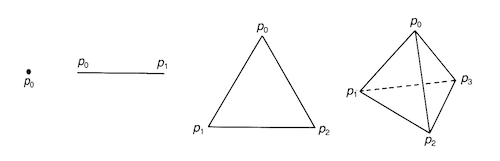
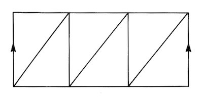
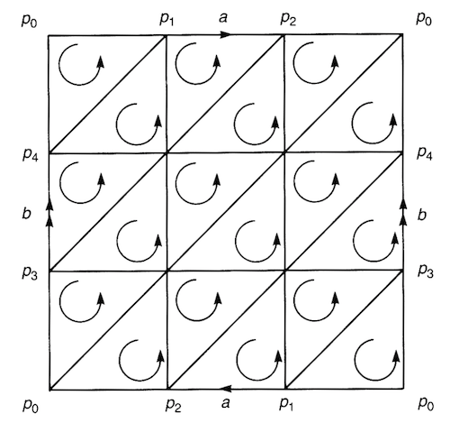

# Simplexes and Simplicial Complexes

## Simplexes

*Definition*:

- **Geometrically independent**: A set of $r+1$ points in $\mathbb{R}^m (m \ge r)$is said to be **geometrically independent** if the points can form an $r$-dimensional object (instead of contained in some lower-dimensional hyper-planes).

- **$r$-Simplex (单纯形) $\sigma_r$**: An object containing an $r$-dimensional region determined by $r+1$ *geometrically independent* points $p_0, ..., p_r$ in $\mathbb{R}^m (m \ge r)$

    $$
    \begin{align*}
        \sigma_r &\equiv
        \langle p_0 p_1 ... p_r \rangle
        \\ &= 
        \left\{
            x = \sum_{i=0}^r c_i p_i 
            \in \mathbb{R}^m \mid
            c_i \ge 0, \, \sum_{i=0}^r c_i = 1
        \right\}
    \end{align*}
    $$

    - **Barycentric coordinate (重心坐标)**: $(c_0, ..., c_r)$
    
    *Remark*: Since $\sigma_r$ is bounded and closed, it is *compact*.
    
    *Example*:

    

       
    *0-, 1-, 2-, and 3-simplexes*

    

- **$q$-Face of a simplex**
    - **Proper face**

## Simplicial Complexes and Polyhedra

*Definition*:

- **Simplicial complex (单纯复形)**: a set $K$ of simplexes satisfying the following requirements:   
    
> 1. Any face of any simplex in $K$ is still in $K$;
>
> 2. The intersection of any two simplexes in $K$ is either *empty* or *a common face of the two simplexes*.

- **Polyhedron**

- **Triangulable topological space**

    - **Triangulation (三角剖分) of topological space**

    *Examples*:

    

       
    *Triangulation of a cylinder*

       
    *Triangulation of a Möbius strip*

       
    *Triangulation of a Klein bottle*

    

## Oriented Simplexes

*Definition*:

- **Oriented $r$-simplex**: An $r$-simplex $\langle p_0 p_1 ... p_r \rangle$ with an assigned orientation, denoted by $(p_0 p_1 ... p_r)$.

- **Convention of orientation choice**:

    - $r > 0$

        Let $P$ be a permutation of numbers 0 to $r$:

        $$
        P = 
        \begin{pmatrix}
            0 & 1 & \cdots & r \\
            i_0 & i_1 & \cdots & i_r
        \end{pmatrix}
        $$

        Then

        $$
        (p_{i_0} p_{i_1} ... ) = \text{sgn}(P) (p_0 p_1 ... p_r)
        $$

        where $\text{sgn}(P) = \pm 1$ is the parity of the permutation $P$. In particular, we note that

        $$
        (p_1 p_2 ... p_r p_0) = (-1)^r (p_0 p_1 ... p_r)
        $$

    - $r = 0$
        
        Oriented 0-simplex is just a point $p_0$, the same as an unoriented 0-simplex.
