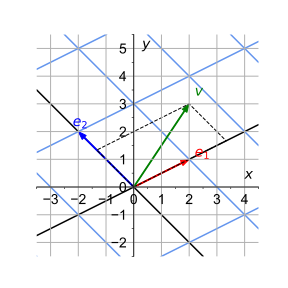
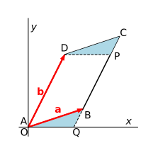

# Introduction to Linear Algebra

### **Part 2: Determinant, Inverse and Change of Basis**

*Credit*: Many ideas of this material come from the [*Essence of Linear Algebra*][LA_3b1b] video series (by Grant Sanderson, a.k.a. 3Blue1Brown).

[LA_3b1b]: https://youtu.be/fNk_zzaMoSs

### **Contents**

- [Determinant of a Matrix](#determinant-of-a-matrix)
    - [2D Determinant](#2d-determinant)
    - [3D Determinant](#3d-determinant)
- [Inverse of Linear Transformation and Matrix](#inverse-of-linear-transformation-and-matrix)
    - [Determinant and Matrix Invertibility](#determinant-and-matrix-invertibility)
    - [Inverse of Product of Matrices](#inverse-of-product-of-matrices)
    - [EXERCISE](#exercise)
- [Change of Basis](#change-of-basis)
    - [Description of the New Basis](#description-of-the-new-basis)
    - [Components of Vectors along the New Basis](#components-of-vectors-along-the-new-basis)
    - [Matrix of Linear Transformation under the New Basis](#matrix-of-linear-transformation-under-the-new-basis)
    - [EXERCISE](#exercise-1)
- [Appendix A: Geometrical Meaning of Determinant](#appendix-a-geometrical-meaning-of-determinant)
    - [2D Determinant = Parallelogram Area](#2d-determinant--parallelogram-area)
    - [3D Determinant = Parallelepiped Volume](#3d-determinant--parallelepiped-volume)
    - [EXERCISE](#exercise-2)
- [Appendix B: Inner Product under the New Basis](#appendix-b-inner-product-under-the-new-basis)

## Determinant of a Matrix

### 2D Determinant

   
*Geometric meaning of 2D determinant*

Let $a, b$ be the two columns of a $2 \times 2$ matrix $A$ (**under an orthonormal basis**, but it need not to be the standard one; this is important)

$$
A = \begin{bmatrix}
    a_1 & b_1 \\
    a_2 & b_2
\end{bmatrix}
$$

We can use the two vectors to construct a **parallelogram** $ABCD$ (see figure), whose *area* is given by the formula (see Appendix; try to prove it by yourself):

$$
\text{Area} = 
|a_1 b_2 - a_2 b_1|
$$

If we are not using the components along an orthonormal basis, the result will be more complicated. The expression inside the absolute value sign $| \, |$ is defined as the **determinant** of matrix $A$, denoted by

$$
\det A \equiv a_1 b_2 - a_2 b_1
$$

The determinant can be a negative number. When $\det A > 0$, we say that the two vectors $a, b$ form a **right-hand basis** of the 2D vector space. Thus the standard basis itself 

$$
e_1 = (1,0)^\mathsf{T}, \quad
e_2 = (0,1)^\mathsf{T}
$$ 

is a right-hand basis.

When $\det A = 0$, it means that $a$ and $b$ are *on the same line*.

### 3D Determinant

   
*Geometric meaning of 3D determinant*

Similar to the 2D case, let $a, b, c$ be the three columns of a $3 \times 3$ matrix $A$ (**under orthonormal basis**)

$$
A = \begin{bmatrix}
    a_1 & b_1 & c_1 \\
    a_2 & b_2 & c_2 \\
    a_3 & b_3 & c_3
\end{bmatrix}
$$

We can use the three vectors to construct a **parallelepiped** (see figure), whose *volume* is given by the formula (see Appendix):

$$
\begin{align*}
    \text{Volume} = 
    | &a_1 b_2 c_3 + a_2 b_3 c_1 + a_3 b_1 c_2 \\
    &- a_3 b_2 c_1 - a_2 b_1 c_3 - a_1 b_3 c_2|
\end{align*}
$$

The expression inside the absolute value sign $| \, |$ is defined as the **determinant** of matrix $A$, still denoted by $\det A$. It can be rewritten in terms of 2D determinants:

$$
\det A = a_1 \det \begin{bmatrix}
    b_2 & c_2 \\
    b_3 & c_3 
\end{bmatrix}
- a_2 \det \begin{bmatrix}
    b_1 & c_1 \\
    b_3 & c_3 
\end{bmatrix}
+ a_3 \det \begin{bmatrix}
    b_1 & c_1 \\
    b_2 & c_2 
\end{bmatrix}
$$

When $\det A > 0$, we say that the two vectors $a, b$ form a **right-hand basis** of the 3D vector space. Thus the standard basis itself

$$
e_1 = (1,0,0)^\mathsf{T}, \quad 
e_2 = (0,1,0)^\mathsf{T}, \quad
e_3 = (0,0,1)^\mathsf{T}
$$ 

is a right-hand basis.

When $\det A = 0$, it means that $a, b, c$ are *on the same plane*.

## Inverse of Linear Transformation and Matrix

For a given linear transformation $A$, *if we can find* another transformation $B$ that completely *cancels* the effect of $A$, *and* $A$ completely cancels the effect of $B$, then we say that $A$ and $B$ are the **inverse of each other**. 

The matrix representation of $B$ is called the **inverse** of the matrix $A$. We shall use the notation $A^{-1}$ to denote both the inverse transformation and the inverse matrix.

Mathematically, "completely cancel" means

$$
A A^{-1} = A^{-1} A = 1
$$

where $1$ is the **identity transformation**, whose effect is no effect at all. Its matrix representation is called the **identity matrix**, the same under any choice of basis vectors:

$$
(1)_{ij} = \delta_{ij}
= \begin{bmatrix}
    1 & & \\
    & \ddots & \\
    & & 1
\end{bmatrix}
= \operatorname{diag}(1,...,1)
$$

*Remark*:

- Do *not* use $1/A$ to denote the inverse of $A$.

- Note that we used the expression "if we can find". This means that some linear transformation does *not* have its inverse.

- We state without proof that if a linear transformation is invertible, then *its inverse is unique*. 

Here we shall not teach you how to calculate the inverse of an arbitrary invertible matrix, which can be done by computers. 

### Determinant and Matrix Invertibility

Consider a linear transformation $A$.

   
*A non-invertible 2D linear transformation*   
*(Screenshot from the linear transformation demo)*

First suppose $A$ is in 2D, it is not difficult to understand if $A$ transforms the two basis vectors to the *same line* (see figure), then we *lost the information in one dimension*, since any linear combination of $A e_1, A e_2$ gives vectors on that same line. Thus the transformation will *not* be invertible. 

Similarly, for $A$ in 3D, if $A$ transforms the two basis vectors to the *same plane* (including the case when all basis vectors are transformed to the same line), then we lost the information in one (or even two) dimension(s). Then the transformation will *not* be invertible. 

These cases happen when $\det A = 0$. Thus we obtain the following criteria for $A$ to be invertible.

**A (square) matrix $A$ is invertible if and only if $\det{A} \ne 0$.**

This holds for any dimensions. 

### Inverse of Product of Matrices

When you invert a product of matrices, the order of the product sequence should be *reversed*, i.e.

$$
\left(A_1A_2 \cdots A_n\right){}^{-1}
= A_n^{-1} \cdots A_2^{-1} A_1^{-1}
$$

This is easy to understand if you think in terms of the transformations they represent. For example, consider the problem of putting an elephant into a refrigerator with closed doors. We need to do it in 3 steps:

|Operation|Represented by|
|-:|:-|
|Open the door|$A_1$|
|Move the elephant in|$A_2$|
|Close the door|$A_3$|

Is it obvious to you that $A_1, A_3$ are inverse of each other? Net effect: 

$$
\begin{align*}
    &|\text{elephant in refrigerator} \rangle
    \\
    & \quad = 
    A_3 A_2 A_1 | \text{elephant out of refrigerator} \rangle
\end{align*}
$$

The inverse operation is evidently

|Operation|Represented by|
|-:|:-|
|Open the door|$A_3^{-1}$|
|Move the elephant out|$A_2^{-1}$|
|Close the door|$A_1^{-1}$|

Net effect: 

$$
\begin{align*}
    &|\text{elephant out of refrigerator} \rangle
    \\
    & \quad = 
    A_1^{-1} A_2^{-1} A_3^{-1} | \text{elephant in refrigerator} \rangle
\end{align*}
$$

### EXERCISE

- Calculate $\det 1$. What does it mean?

- For a general $2 \times 2$ matrix
    
    $$
    A = \begin{bmatrix}
        a & b \\
        c & d
    \end{bmatrix}
    $$

    - When will $A$ be invertible?
    
    - Explicitly calculate $A^{-1}$. Verify your answer for the last question. 

## Change of Basis

Sometimes the standard basis may not be very convenient. Thus we naturally face the question of how to describe things using another set of basis vectors. It is expected that if we change to a new set of basis vectors:

- A vector will have different components 
- A linear transformation will be represented by a different matrix

In this section we shall show, in two dimensions, how to find the components of vectors and representation matrices of linear transformations under a new set of basis vectors. The generalization to higher dimensions is straightforward.

### Description of the New Basis

The new basis $e'_1, e'_2$ can always be described by their components along the old basis $e_1, e_2$ (which need not be the standard basis). In other words, the new basis is related to the old basis by a linear transformation $\mathcal{D}$:

$$
e'_1 = \mathcal{D} e_1 
= \begin{bmatrix}
    \mathcal{D}_{11} \\ \mathcal{D}_{21}
\end{bmatrix}, 
\quad
e'_2 = \mathcal{D} e_2
= \begin{bmatrix}
    \mathcal{D}_{12} \\ \mathcal{D}_{22}
\end{bmatrix}
$$

Thus the change from the old basis to the new basis is described by the matrix (under the old basis)

$$
\mathcal{D} = \begin{bmatrix}
    \mathcal{D}_{11} & \mathcal{D}_{12} \\
    \mathcal{D}_{21} & \mathcal{D}_{22}
\end{bmatrix}
$$

*Remark*: The inverse operation, i.e. change from the new basis to the old basis, is described by the inverse matrix $\mathcal{D}^{-1}$ (**under the new basis**).

### Components of Vectors along the New Basis

For an arbitrary vector, its components along the new and the old basis vectors are related by

$$
\begin{align*}
    v 
    &= v_1 e_1 + v_2 e_2 
    &\quad &\text{(in old basis)}
    \\
    &= v'_1 e'_1 + v'_2 e'_2 
    &\quad &\text{(in new basis)}
    \\
    &= v'_1 \mathcal{D}e_1 + v'_2 \mathcal{D} e_2 
    \\
    &= \mathcal{D} (v'_1 e_1 + v'_2 e_2)
    &\quad &\text{(using linearity of $\mathcal{D}$)}
\end{align*}
$$

Using the matrix notation to make the expression more clear:

$$
\begin{bmatrix}
    v_1 \\ v_2
\end{bmatrix}
= \mathcal{D} \begin{bmatrix}
    v'_1 \\ v'_2
\end{bmatrix}
$$

Thus the components of $v$ along the new basis are given by

$$
\begin{bmatrix}
    v'_1 \\ v'_2
\end{bmatrix} = \mathcal{D}^{-1}
\begin{bmatrix}
    v_1 \\ v_2
\end{bmatrix} 
\quad \text{or} \quad
v' = \mathcal{D}^{-1} v
$$

where $v' \equiv v'_1 e_1 + v'_2 e_2$ is the vector constructed using the *new* components and the *old* basis vectors.

### Matrix of Linear Transformation under the New Basis

In the *basis-free* language, for an arbitrary vector $v \in V$, a linear transformation $A$ sends it to another vector $w \in V$:

$$
w = A v
$$

In the old basis ("un-primed"), we have the matrix form

$$
\begin{bmatrix}
    w_1 \\
    w_2
\end{bmatrix} 
= \begin{bmatrix}
    A_{11} & A_{12} \\
    A_{21} & A_{22}
\end{bmatrix}
\begin{bmatrix}
    v_1 \\
    v_2
\end{bmatrix} 
\quad \text{or} \quad 
w = A v
$$

In the new basis, we have a similar expression (with all elements "primed")

$$
\begin{bmatrix}
    w'_1 \\
    w'_2
\end{bmatrix} 
= \begin{bmatrix}
    A'_{11} & A'_{12} \\
    A'_{21} & A'_{22}
\end{bmatrix}
\begin{bmatrix}
    v'_1 \\
    v'_2
\end{bmatrix}
\quad \text{or} \quad 
w' = A' v'
$$

The matrix $A'$ is exactly the representation of the transformation $A$ under the new basis. Remember that

$$
w' = \mathcal{D}^{-1} w , \quad
v' = \mathcal{D}^{-1} v
$$

Then we obtain

$$
\begin{align*}
    \mathcal{D}^{-1} w 
    &= A' \mathcal{D}^{-1} v
    \\
    &= \mathcal{D}^{-1} A v \qquad (w = A v)
\end{align*}
$$

Since $v$ is arbitrary, we must have

$$
A' \mathcal{D}^{-1} = \mathcal{D}^{-1} A
$$

Multiply both sides by $\mathcal{D}$ *on the right*, we obtain the new representation matrix $A'$:

$$
A' = \mathcal{D}^{-1} A \mathcal{D}
$$

*Remark*: If two matrices $A,B$ are related by a change of basis, i.e.

$$
B=\mathcal{D}^{-1}A \mathcal{D}
$$

we say that $A$ and $B$ are **similar** to each other (the word "similar" is chosen for obvious reasons). The "sandwich" operation $\mathcal{D}^{-1}A \mathcal{D}$ is called a **similarity transformation**.

### EXERCISE

   
*An example of change of basis*

From the information of the figure above:

- Write down the matrix $\mathcal{D}$ representing the change of basis from the standard $e_x, e_y$ to $e_1, e_2$.

- Calculate the new components of the vector $v$. You may find $\mathcal{D}^{-1}$ using a computer. Check if your result agrees with the figure.

## Appendix A: Geometrical Meaning of Determinant

### 2D Determinant = Parallelogram Area

   
*Calculation of area of parallelogram ABCD*

We draw a line through point D parallel to the $x$ axis. Cut off the triangle DPC and move it to AQB. Now we obtain a new parallelogram AQPD, which has the same area as ABCD. 

However, since its base AQ is on the $x$ axis, the formula $A = ah$ can now be applied directly. The height of AQPD is obviously equal to $b_{y}$. It remains to find the base AQ.

Since BQ is parallel to $\boldsymbol{b}$, we can set

$$\overrightarrow{BQ} = \alpha\boldsymbol{b}$$

Then, from $\overrightarrow{OQ} = \overrightarrow{AB} + \overrightarrow{BQ} = \boldsymbol{a} + \alpha\boldsymbol{b}$, we obtain (for the $x,y$ components respectively)

$$
\left.
\begin{align*}
    x_{Q} = a_{x} + \alpha b_{x} \\
    0 = a_{y} + \alpha b_{y}
\end{align*}
\right\}
\, \Rightarrow \,
\left\{
\begin{align*}
    &\alpha = - \frac{a_{y}}{b_{y}}
    \\
    &x_{Q} = a_{x} - \frac{a_{y}b_{x}}{b_{y}}
\end{align*}
\right.
$$

Finally

$$
A = |x_{Q}| |b_{y}| 
= |a_{x}b_{y} - a_{y}b_{x}|
$$

### 3D Determinant = Parallelepiped Volume

   
*Calculation of volume of parallelepiped*

Let CSTU be the cross-section through C of the parallelepiped parallel to the $xy$-plane. We observe that if we move the part above CSTU to the bottom of the parallelepiped, we will get a new parallelepiped OPQR-CSTU (notice that OPQR is *in the* $xy$*-plane*), which has the same volume as the original parallelepiped.

Let the coordinates of P and R be respectively

$$P:\left( x_{P},\ y_{P},\ 0 \right),\ \ R:\left( x_{R},\ y_{R},\ 0 \right)$$

The vectors $\overrightarrow{AP}$ and $\overrightarrow{BR}$ are parallel to $\boldsymbol{c}$. Therefore, they can be expressed as

$$\overrightarrow{AP} = \alpha\boldsymbol{c},\ \ \overrightarrow{BR} = \beta\boldsymbol{c}$$

And the coordinates of P and Q can be found from

$$\overrightarrow{OP} = \overrightarrow{OA} + \overrightarrow{AP} = \boldsymbol{a} + \alpha\boldsymbol{c},\ \ \overrightarrow{OR} = \overrightarrow{OB} + \overrightarrow{BR} = \boldsymbol{b} + \beta\boldsymbol{c}$$

Therefore, we write

$$
\left\{
\begin{align*}
    x_{P} = a_{x} + \alpha c_{x} \\
    y_{P} = a_{y} + \alpha c_{y} \\
    0 = a_{z} + \alpha c_{z} 
\end{align*}
\right. ,
\quad
\left\{
\begin{align*}
    x_{R} = b_{x} + \beta c_{x} \\
    y_{R} = b_{y} + \beta c_{y} \\
    0 = b_{z} + \alpha c_{z}
\end{align*}
\right.
$$

from which we obtain

$$
\alpha = - \frac{a_{z}}{c_{z}} ,\quad
\beta = - \frac{b_{z}}{c_{z}}
$$

Therefore

$$
\left\{
\begin{align*}
    x_{P} = a_{x} - \frac{a_{z}c_{x}}{c_{z}} \\
    y_{P} = a_{y} - \frac{a_{z}c_{y}}{c_{z}}
\end{align*}
\right. , 
\quad
\left\{
\begin{align*}
    x_{R} = b_{x} - \frac{b_{z}c_{x}}{c_{z}} \\
    y_{R} = b_{y} - \frac{b_{z}c_{y}}{c_{z}}
\end{align*}
\right.
$$

Using the results for 2D, we immediately get

$$
\begin{align*}
    &A_{\text{OPQR}} 
    = \det \begin{bmatrix}
        x_{P} & x_{R} \\
        y_{P} & y_{R}
    \end{bmatrix}
    \\
    &= \frac{1}{c_{z}}\left( a_{x}b_{y}c_{z} + a_{y}b_{z}c_{x} + a_{z}b_{x}c_{y} - a_{z}b_{y}c_{x} - a_{y}b_{x}c_{z} - a_{x}b_{z}c_{y} \right)
\end{align*}
$$

The height of the new parallelepiped is evidently equal to $c_{z}$. Then, the volume $V$ is simply

$$
\begin{align*}
    V &= A_{\text{OPQR}} \times c_{z} 
    \\
    &= a_{x}b_{y}c_{z} + a_{y}b_{z}c_{x} + a_{z}b_{x}c_{y} - a_{z}b_{y}c_{x} - a_{y}b_{x}c_{z} - a_{x}b_{z}c_{y}
\end{align*}
$$

This defines the determinant

$$
V = \det \begin{bmatrix}
    a_{x} & b_{x} & c_{x} \\
    a_{y} & b_{y} & c_{y} \\
    a_{z} & b_{z} & c_{z} \\
\end{bmatrix}
$$

### EXERCISE

Generalize the above procedure to derive the expression of the 4D determinant. Its absolute value defines the "volume" of a 4D parallelepiped.

## Appendix B: Inner Product under the New Basis

Geometrically, the inner product $u, v$ depends only on the length of $u, v$ and the angle $\theta$ between them:

$$
u \cdot v = |u| |v| \cos \theta
$$

Thus intuitively, inner product should be *invariant* under change of basis, which does not change the vectors at all. Now let us verify it (this is a good exercise of matrix multiplication and Einstein summation rule; do it by yourself before looking at the answer below).

Under the old basis:

$$
u \cdot v = u_i v_j (e_i \cdot e_j)
$$

Under the new basis:

$$
\begin{align*}
    u \cdot v 
    &= u'_i v'_j (e'_i \cdot e'_j)
    \\
    &= (\mathcal{D}^{-1} u)_i (\mathcal{D}^{-1} v)_j
    \times
    ((\mathcal{D} e_i) \cdot (\mathcal{D} e_j))
    \\
    &= (\mathcal{D}^{-1})_{ik} u_k
    (\mathcal{D}^{-1})_{jl} v_l
    \times
    (\mathcal{D} e_i)_m (\mathcal{D} e_j)_n
    (e_m \cdot e_n)
    \\
    &= (\mathcal{D}^{-1})_{ik} u_k
    (\mathcal{D}^{-1})_{jl} v_l
    \times
    \mathcal{D}_{ma} (e_i)_a
    \mathcal{D}_{nb} (e_j)_b
    (e_m \cdot e_n)
\end{align*}
$$

However, we know that the $a$th component of $e_i$ along the basis itself is

$$
(e_i)_a = \delta_{i a}
$$

Similarly $(e_j)_b = \delta_{jb}$. Therefore

$$
\begin{align*}
    u \cdot v 
    &= (\mathcal{D}^{-1})_{ik} u_k
    (\mathcal{D}^{-1})_{jl} v_l
    \times
    \mathcal{D}_{ma} \delta_{ia}
    \mathcal{D}_{nb} \delta_{jb}
    (e_m \cdot e_n)
    \\
    &= (\mathcal{D}^{-1})_{ik} u_k
    (\mathcal{D}^{-1})_{jl} v_l
    \times
    \mathcal{D}_{mi} \mathcal{D}_{nj} 
    (e_m \cdot e_n)
    \\
    &= [\mathcal{D}_{mi} (\mathcal{D}^{-1})_{ik}]
    [\mathcal{D}_{nj} (\mathcal{D}^{-1})_{jl}]
    u_k v_l (e_m \cdot e_n)
    \\
    &= (\mathcal{D}\mathcal{D}^{-1})_{mk}
    (\mathcal{D}\mathcal{D}^{-1})_{nl}
    u_k v_l (e_m \cdot e_n)
    \\
    &= \delta_{mk} \delta_{nl} u_k v_l (e_m \cdot e_n)
    \\
    &= u_m v_n (e_m \cdot e_n)
\end{align*}
$$

Renaming $m,n$ to $i,j$, we have verified the result of $u \cdot v$ is unchanged if we calculate using the components along the new basis.