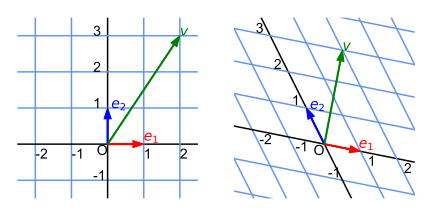
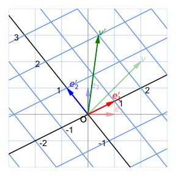
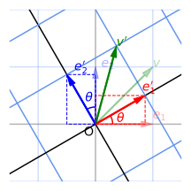
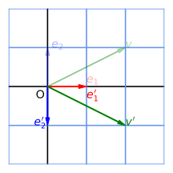
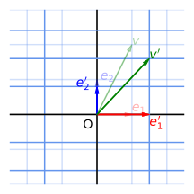
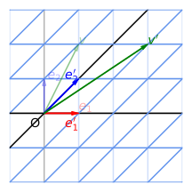
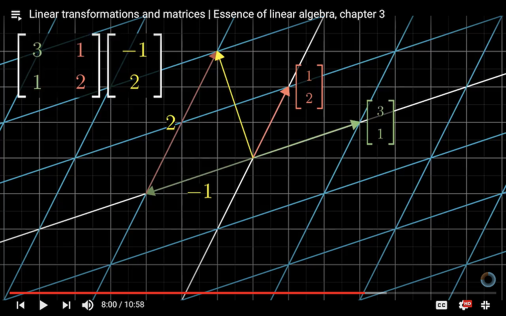

# Introduction to Linear Algebra

### **Part 1: Linear Transformation and Matrix**

*Credit*: Many ideas of this material come from the [*Essence of Linear Algebra*][LA_3b1b] video series (by Grant Sanderson, a.k.a. 3Blue1Brown).

[LA_3b1b]: https://youtu.be/fNk_zzaMoSs

### **Contents**

- [Vector Spaces and Basis Vectors](#vector-spaces-and-basis-vectors)
    - [Vector Spaces](#vector-spaces)
    - [Linear Independence](#linear-independence)
    - [Basis Vectors](#basis-vectors)
    - [Note on Notations: Einstein Summation Rule](#note-on-notations-einstein-summation-rule)
- [Linear Transformations](#linear-transformations)
    - [Matrix Representation of Linear Transformations](#matrix-representation-of-linear-transformations)
    - [Interlude: Transpose of Matrix](#interlude-transpose-of-matrix)
    - [Examples of 2D Linear Transformations](#examples-of-2d-linear-transformations)
    - [EXERCISE](#exercise)
- [Matrix-Vector Multiplication](#matrix-vector-multiplication)
    - [EXERCISE](#exercise-1)
- [Composition of Linear Transformation](#composition-of-linear-transformation)
    - [EXERCISE](#exercise-2)
- [Appendix: Inner Product](#appendix-inner-product)
    - [Defining Properties](#defining-properties)
    - [Orthonormal Basis Vectors](#orthonormal-basis-vectors)
    - [Inner Product under Linear Transformation](#inner-product-under-linear-transformation)
    - [Orthogonal Matrix](#orthogonal-matrix)
    - [EXERCISE](#exercise-3)

## Vector Spaces and Basis Vectors

### Vector Spaces

For the purpose of an introductory physics course, **vectors** can be imagined as arrows in the plane (2D), the space (3D) or in higher dimensional spaces, and a **vector space** (denoted by $V$) is the collection (set) of all vectors in that space. 

We can perform the following operations on vectors in the vector space:

- **Addition** of vectors

- **Scalar multiplication** on a vector (by *real* numbers)

    (Later in your life you will have to deal with *complex* numbers, but now we restrict ourselves to the real world.)

[vec_space]: https://en.wikipedia.org/wiki/Vector_space

### Linear Independence

First we introduce an commonly encountered concept in linear algebra. Consider a set of vectors $e_1, e_2, ..., e_n \in V$. Since we have vector addition and scalar multiplication in the vector space $V$, we can construct a *linear combination* of them, with (real) coefficients $v_1, ..., v_n$: 

$$
v = v_1 e_1 + \cdots + v_n e_n
= \sum_{i=1}^n v_i e_i \in V
$$

Then the vectors $e_1, ..., e_n$ are said to be **linearly independent** if

$$
v = \sum_{i=1}^n v_i e_i = 0 
\, \Leftrightarrow \,
v_1 = \cdots = v_n = 0
$$

i.e. the zero vector can *only* be obtained by setting *all* combination coefficients to zero. 

*Remark*: The set of all vectors obtained from linear combinations is called the **span** of the vectors $e_1, ..., e_n$, denoted by

$$
\operatorname{span} (e_1, ..., e_n)
= \left\{
    \sum_{i=1}^n v_i e_i \mid
    v_1, ..., v_n \in \mathbb{R}
\right\}
$$

### Basis Vectors

Given a set of *linearly independent* vectors $\{e_1,...,e_n\}$, if *any* vector $v\in V$ can be *uniquely* represented as a linear combination of $e_1, ..., e_n$

$$
v = \sum_{i=1}^{n} v_i e_i
\qquad v_1,...,v_n\in \mathbb{R}
$$

Then the vectors $e_1, ..., e_n$ are called **basis vectors** of $V$. The number of these vectors $n$ is called the **dimension** of $V$ (denoted by $\dim V$). 

The number $v_i$ is called the **components** of the vector $v$ along the basis vector $e_i$. Then the vector $v$ can be also written as a **column vector** (without explicit reference to the basis we are using)

$$
v = \begin{bmatrix}
    v_1 \\ \vdots \\ v_n
\end{bmatrix}
$$

*Remarks*:

- Usually we choose an **orthonormal basis**, i.e. each basis vector is of length 1, and is orthogonal to other basis vectors (i.e. **inner product** is zero). 
    
    An example is the usual $x, y, ...$ unit vectors (let us call them the **standard basis**). In this case, the components of a vector *coincides* with the coordinates of the end point of the vector. 

- The choice of basis vectors is *not unique*, since there are *infinitely many* sets of $n$ linearly-independent vectors in the vector space $V$. For example (say $n = 2$), if $e_1, e_2$ are basis vectors of $V$, then we can also use

    $$
    e'_1 = e_1 + 3e_2, \quad
    e'_2 = 2e_1 - e_2
    $$

- In the expansion of basis vectors themselves
    
    $$
    e_i = \sum_{a=1}^n (e_i)_a e_a
    $$

    The $a$th component of the $i$th basis vector is simply 

    $$
    (e_i)_a = \delta_{ia}
    = \begin{cases}
        0, & a \ne i \\
        1, & a = i
    \end{cases}
    $$

    The notation $\delta_{ia}$ is called the **Kronecker delta**. For example, when $\dim{V} = 2$, we have

    $$
    e_1 = \begin{bmatrix}
        1 \\ 0
    \end{bmatrix}, \quad
    e_2 = \begin{bmatrix}
        0 \\ 1
    \end{bmatrix}
    $$

    You must be aware that **this does not mean that they are the standard basis**. 

- Two vectors of the same components will be different if the sets of basis vectors used to construct them are not the same. 

    

       
    *Two different vectors can have the same components (2, 3)  under different basis; the figures are drawn to the same scale*

    

### Note on Notations: Einstein Summation Rule

People are tired of always writing the summation sign $\sum$ in linear algebra calculations. Thus the genius Einstein invented the following rule: 

**If an index appears twice, then sum over it.**

which allows people to throw away the summation signs. For example:

$$
\sum_i v_i e_i \to v_i e_i
$$

The index $i$ appears twice, thus we should sum over $i$. Unless there might be some ambiguity, we shall always adopt the Einstein summation rule in the following. 

In addition, we are free to choose which letter represents the index to be summed over:

$$
\sum_i v_i e_i = \sum_j v_j e_j  = \cdots
\, \Rightarrow \,
v_i e_i = v_j e_j = \cdots
$$

## Linear Transformations

A **linear transformation** (denoted by $A$) on a vector space $V$ maps a vector $u \in V$ to another vector $v = Au \in V$:

$$
A: V \to V
$$

The transformation must satisfy the following two *defining* requirements (called the **linearity conditions**):

- $\forall \, u, v\in V \qquad \quad A(u + v)=A u + A v$

- $\forall \, v\in V, c\in \mathbb{C} \quad A(c u) = c (A u)$

In other words, it does not matter whether you perform linear transformations before or after vector addition and scalar multiplication. 

### Matrix Representation of Linear Transformations

The above definition is somewhat abstract. Let us represent it by something more concrete: the **matrix**. 

Due to the linearity, a linear transformation $A$ can be *fully* described by specifying its action on *each* basis vector ($i = 1, ..., n$):

$$
e_i \to e'_i \equiv A e_i
$$

Then for any vector $v$, we have

$$
\begin{align*}
    v' 
    &\equiv A v 
    \\
    &= A (v_i e_i) 
    &\quad &\text{(Expand $v$ using $\{e_i\}$)}
    \\
    &= v_i (A e_i) 
    &\quad &\text{(Use linearity of $A$)}
    \\
    &= v_i e'_i
    &\quad &(e'_i = A e_i)
\end{align*}
$$

We note that components of $v'$ along the new basis are the same as the components of $v$ along the old basis.

   
*An arbitrary linear transformation in 2D. In this figure $v = 2 e_1 + 2 e_2$.*

Nothing prevents us to expand $e'_i$ as linear combination of the basis vectors: 

$$
e'_i = A e_i = e_j A_{j i} \qquad (i = 1, ..., n)
$$

The numbers $A_{j i}$ are linear combination coefficients. We do not write $A_{i j} e_j$, which is just a matter of convention. 

For example, when $\dim{V} = 2$:

$$
\begin{align*}
    e'_1 &= A e_1 = A_{11} e_1 + A_{21} e_2
    = \begin{bmatrix}
        A_{11} \\ A_{21}
    \end{bmatrix}
    \\
    e'_2 &= A e_2 = A_{12} e_1 + A_{22} e_2
    =\begin{bmatrix}
        A_{12} \\ A_{22}
    \end{bmatrix}
\end{align*}
$$

Then we combine this two column vectors to form a **matrix** that represents the linear transformation $A$ (it does not matter whether you use usual or square brackets):

$$
A = \begin{bmatrix}
    A_{11} & A_{12} \\
    A_{21} & A_{22}
\end{bmatrix} \quad
\text{(under the basis $\{e_1, e_2\}$)}
$$

In this construction, $A_{i j}$ means the matrix element at the $i$th row and the $j$th column.

Remember the meaning of each column of the transformation matrix: **the $i$th column is the transformation result of the $i$th basis vector**. 

### Interlude: Transpose of Matrix

The matrix obtained by *exchanging lines and rows* of $A$ is called the **transpose** of $A$, denoted by $A^\mathsf{T}$. By definition

$$
(A^\mathsf{T})_{i j} \equiv A_{j i}
$$

For example

$$
A^\mathsf{T} = \begin{bmatrix}
    A_{11} & A_{21} \\
    A_{12} & A_{22}
\end{bmatrix}
$$

A column vector can be regarded as a matrix of only one column; so we have

$$
v^\mathsf{T} = (v_1, \cdots, v_n)
$$

This is called a **row vector**.

### Examples of 2D Linear Transformations

In all the following examples, we use the standard basis to describe the transformation. 

- **Rotation**

    

       
    *2D counter-clockwise rotation by angle $\theta$*

    

    You can easily determine from the above figure that the standard basis $e_1, e_2$ are transformed to

    $$
    e'_1 = \begin{bmatrix}
        \cos \theta \\
        \sin \theta
    \end{bmatrix}, \quad
    e'_2 = \begin{bmatrix}
        -\sin \theta \\
        \cos \theta
    \end{bmatrix}
    $$
    
    You can verify that $\{e'_1, e'_2\}$ is still an orthonormal basis. Therefore, the representation matrix of rotation is

    $$
    R(\theta) = \begin{bmatrix}
        \cos \theta & -\sin \theta\\
        \sin \theta & \cos \theta
    \end{bmatrix}
    $$

- **Reflection**

    

       
    *Reflection with respect to x-axis*

    

- **Scaling (Dilation)**

    

       
    *Scaling by $e'_1 = 1.5 e_1$ (stretching) and $e'_2 = 0.8 e_2$ (shortening)*

    

- **Shear**

    

       
    *Shear along direction of $e_1$ by $e'_2 = e_2 + e_1$*

    

*Remark*: **Translation** ($T: v \to v + t$, where $t$ is the translation vector) is not a linear transformation! You can easily verify, for two vectors $v, w \in V$

$$
\left.
\begin{align*}
    T (v + w) &= (v + w) + t
    \\
    T v + T w &= (v + w) + 2t
\end{align*}
\right\} \Rightarrow
T(v + w) \ne Tv + Tw
$$

You can read [this Wikipedia article][affine_trans] to see how to use matrices *in $(d+1)$ dimension* to represent $d$-dimensional translations. 

[affine_trans]: https://en.wikipedia.org/wiki/Affine_transformation#Representation

### EXERCISE

Write down the transformation matrices of the reflection, the scaling, and the shear transformations shown above. 

## Matrix-Vector Multiplication

Using the linearity $A$, we can find the new vector $A v$ to which the vector $v$ is sent by the linear transformation $A$: 

$$
\begin{align*}
    v' &= v_j e'_j
    \\
    &= v_j (e_i A_{i j}) 
    &\quad &\text{(Expand $e'_j$ using $\{e_i\}$)}
    \\
    &= (A_{i j} v_j) e_i
    &\quad &\text{(Rearrange)}
\end{align*}
$$

Meanwhile, under the old basis $\{e_i\}$

$$
v' = Av = (Av)_i e_i
$$

Therefore, the components of $A v$ are given by

$$
(A v)_i = A_{i j} v_j
$$

This is *defined* as the rule of the multiplication of matrix $A$ and column vector $v$.

For example, when $\dim{V} = 2$:

$$
A v =
\begin{bmatrix}
    A_{11} & A_{12} \\
    A_{21} & A_{22}
\end{bmatrix}
\begin{bmatrix}
    v_1 \\
    v_2
\end{bmatrix}
= \begin{bmatrix}
    A_{11} v_1 + A_{12} v_2 \\
    A_{21} v_1 + A_{22} v_2
\end{bmatrix}
$$

### EXERCISE

   
*(Have you watched the [videos][LA_3b1b] now?)*

Let

$$
A = \begin{bmatrix}
    3 & 1 \\
    1 & 2
\end{bmatrix} \quad
v = \begin{bmatrix}
    -1 \\ 2
\end{bmatrix}
$$

- Compute the transformation result $A v$. 

- Can you directly read off the answer from the figure above?

## Composition of Linear Transformation

Suppose we have two linear transformations $A, B$. We first apply $B$ onto a vector $v$, then apply $A$. The result of the combined transformation is denoted by $A B v$ (the transformations are written from right to left according to the order).

Now let us find its components: using the representation matrices of $A,B$ under the same (original) basis, we have

$$
\begin{align*}
    [A (B v)]_{i}
    = A_{i j} (B v)_{j}
    = A_{i j} (B_{j k} v_k)
    = A_{i j} B_{j k} v_k
\end{align*}
$$

We discover that if we define a new matrix $C$ by

$$
C_{i k} \equiv A_{i j} B_{j k}
$$

We obtain

$$
[A(B v)]_i = C_{ik} v_k
$$

This means that *$C$ is the representation matrix of the composite transformation $AB$* (under the original basis). Thus we define that the **product** of the matrices $A, B$ is 

$$
(AB)_{i k} \equiv A_{i j} B_{j k}
$$

so that

$$
[A(B v)]_i = [(AB) v]_i
$$

For example, when $\dim{V} = 2$

$$
AB = \begin{bmatrix}
    A_{11} B_{11} + A_{12} B_{21} & A_{11} B_{12} + A_{12} B_{22} \\
    A_{21} B_{11} + A_{22} B_{21} & A_{21} B_{12} + A_{22} B_{22}
\end{bmatrix}
$$

### EXERCISE

The matrix product defined in this way has the following properties:

- **Associativity**: $(AB)C = A(BC)$

- **Non-commutativity**: In general $AB \ne BA$

Please prove (or verify) them. 

## Appendix: Inner Product

*If you already know how to compute inner product in the $xy$ or $xyz$ coordinate system, in this appendix, we want you to forget it.*

### Defining Properties

For two vectors $u,v\in V$, we can define an operation called the **inner product** (denoted by $u \cdot v$), which send two vectors *to a real number*: 

$$
\_ \cdot \_ : V \times V \to \mathbb{R}
$$

Inner product is *defined to have* the following properties:

- **Symmetry**: $\forall \, u,v \in V$

    $$
    u \cdot v = v \cdot u
    $$

- **Linearity in the second argument**: $\forall \, u,v,w \in V ;\, \alpha,\beta \in \mathbb{R}$
    
    $$
    u \cdot (\alpha v + \beta w) 
    = \alpha (u \cdot v) + \beta(u \cdot w)
    $$

The two properties combined gives linearity in the first argument, too (show this by yourself; thus we say that the inner product is a **bi-linear** function):

$$
(\alpha v + \beta w) \cdot u
= \alpha (v \cdot u) + \beta(w \cdot u)
$$

Up to now we have not really define how to *calculate* the inner product. It turns out that there are many ways to define the calculation that satisfy the two properties above. We can then also generalize the concept of inner product to more abstract vector spaces.

*Remark*: Some concepts derived from the inner product

- Two vectors are **orthogonal** to each other if their inner product is 0.
- The **length** of a vector $v$ is defined as $|v| \equiv \sqrt{v \cdot v}$. 

### Orthonormal Basis Vectors

Until now we have not described how to really calculate the inner product. For two vectors $u,v \in V$

$$
u = u_i e_i, \quad v = v_i e_i
$$

Due to bi-linearity of inner product, $u \cdot v$ can be reduced to the linear combination of the inner product of basis vectors:

$$
u \cdot v = u_i v_j (e_i \cdot e_j)
$$

The numbers $e_i \cdot e_j$ are still not determined, and depend on both the choice of basis vectors, which is *not unique*. Now we pick a *special* choice of basis vectors such that

$$
e_i \cdot e_j = \delta_{ij} 
= \begin{cases}
    1 & i = j \\
    0 & i \ne j
\end{cases}
$$

i.e. each basis vector has length 1, and is orthogonal to all other basis vectors. You can just imagine them as the familiar unit vectors along the coordinate axes. Such a set of basis vectors is called an **orthonormal basis** (orthogonal and normalized).

Then we recover something you already know:

$$
u \cdot v = u_i v_j \delta_{ij} = u_i v_i
$$

We emphasize that **this formula is valid only when we are using the components of $u,v$ along an orthonormal basis**.

*Remark*: Even the choice of orthonormal basis is *not unique*. For example, you can easily *rotate* the basis to obtain a new one. This is easy to understand intuitively, but a rigorous mathematical proof of this statement is not very trivial.

### Inner Product under Linear Transformation

After the linear transformation $A$, the inner product $u \cdot v$ is transformed to 

$$
\begin{align*}
    (Au) \cdot (Av)
    &= (Au)_i (Av)_j (e_i \cdot e_j)
    \\
    &= (A_{ik} u_k) (A_{jl} v_l) (e_i \cdot e_j)
\end{align*}
$$

If we are using an orthonormal basis, then

$$
\begin{align*}
    (Au) \cdot (Av)
    &= (A_{ik} u_k) (A_{jl} v_l) \delta_{ij}
    \\
    &= A_{ik} u_k A_{il} v_l
    \\
    &= u_k (A^\mathsf{T})_{ki} A_{il} v_l
    \\
    &= u_k (A^\mathsf{T} A)_{kl} v_l
\end{align*}
$$

### Orthogonal Matrix

Let us consider a special case: if 

$$
A^\mathsf{T} A = 1 \quad
\text{or equivalently $A A^\mathsf{T}$ = 1}
$$

where $1$ is the **identity matrix** (we will talk more about it later)

$$
(1)_{ij} = \delta_{ij}
$$

then

$$
\begin{align*}
    (Au) \cdot (Av)
    &= u_k \delta_{il} v_l
    \\
    &= u_k v_k = u \cdot v
\end{align*}
$$

i.e. the inner product is invariant under $A$. We call such a representation matrix an **orthogonal matrix**. 

### EXERCISE

The name "orthogonal" comes from the fact that *each column of an orthogonal matrix are orthogonal to each other*. Verify this statement.  